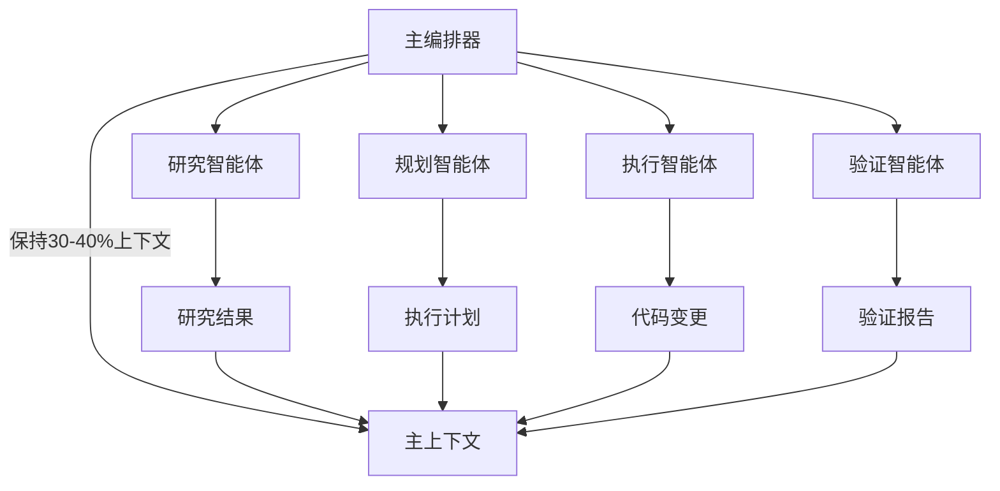
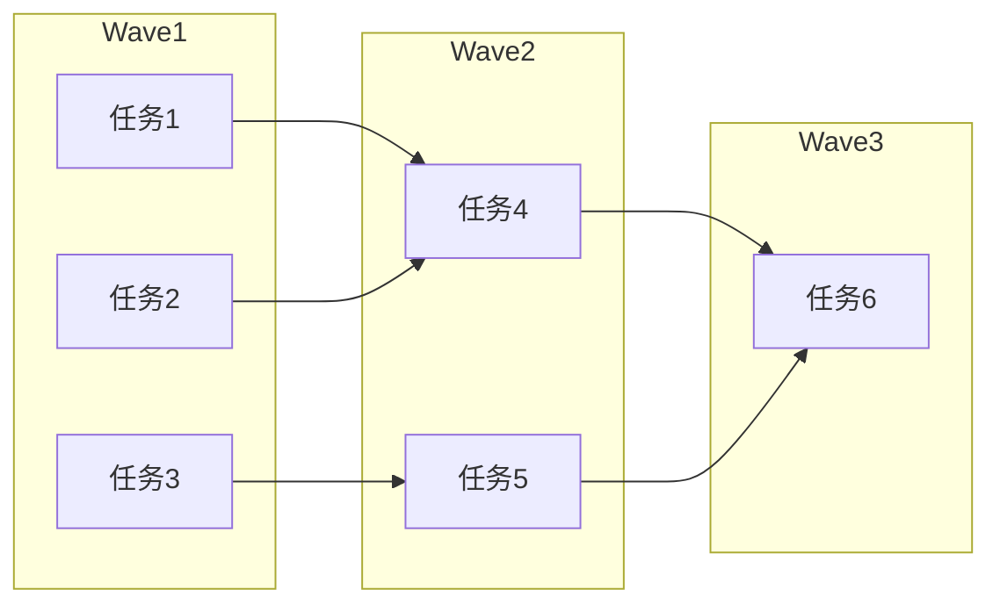

**GSD (Get Shit Done) 是一个轻量级的元提示、上下文工程和规范驱动开发系统，专为 Claude Code、OpenCode、Gemini CLI 等 AI 编程工具设计。** 本文将介绍 GSD 的核心概念、工作流程和实际使用方法，帮助你解决 AI 编程中常见的上下文腐烂问题。

<!-- more -->

## 简介

### 什么是上下文腐烂？

在使用 AI 编程助手时，随着对话的进行，AI 的上下文窗口会逐渐被填满。当上下文接近饱和时，AI 的输出质量会显著下降，表现为：

- 遗忘早期的重要信息
- 输出变得重复或冗长
- 逻辑连贯性下降
- 代码质量变差

这种现象被称为**上下文腐烂 (Context Rot)**，是影响 AI 编程效率的主要瓶颈之一。

### GSD 的解决方案

GSD 通过以下核心技术解决上下文腐烂问题：

| 技术 | 说明 |
|------|------|
| **上下文工程** | 使用结构化文件（PROJECT.md、ROADMAP.md 等）持久化关键信息 |
| **XML 提示格式** | 优化的 XML 结构让 Claude 更准确地理解任务 |
| **多智能体编排** | 主进程保持轻量，繁重任务交给子智能体 |
| **波次执行** | 根据依赖关系并行执行任务，提高效率 |
| **原子提交** | 每个任务独立提交，便于追溯和回滚 |

### 核心设计理念

> "复杂性在于系统，而非工作流程。幕后是上下文工程、XML 提示格式、子智能体编排、状态管理。你看到的是：几个命令，开箱即用。"

GSD 专为独立开发者设计，摒弃了企业级的繁文缛节——没有冲刺会议、没有故事点、没有 Jira 工作流。专注于让 AI 可靠地编写代码。

## 安装

### 系统要求

GSD 支持 macOS、Windows 和 Linux 系统，兼容多种 AI 运行时：

- Claude Code
- OpenCode
- Gemini CLI
- Codex
- Copilot
- Antigravity

### 快速安装

```bash
npx get-shit-done-cc@latest
```

安装完成后，你可以在 Claude Code 中使用 `/gsd:` 前缀的命令。

### 推荐配置

为获得流畅的自动化体验，建议使用以下方式启动 Claude Code：

```bash
claude --dangerously-skip-permissions
```

或者在 `.claude/settings.json` 中配置细粒度权限。

## 工作流程

GSD 采用六步工作流程，从项目初始化到完成里程碑，每一步都有明确的输入输出。


### 步骤概览

| 步骤 | 命令 | 目的 |
|------|------|------|
| 1 | `/gsd:new-project` | 初始化：问答 → 研究 → 需求 → 路线图 |
| 2 | `/gsd:discuss-phase N` | 规划前捕获实现决策 |
| 3 | `/gsd:plan-phase N` | 研究 + 规划 + 验证阶段 |
| 4 | `/gsd:execute-phase N` | 并行波次执行计划 |
| 5 | `/gsd:verify-work N` | 用户验收测试 |
| 6 | `/gsd:complete-milestone` | 归档并打标签发布 |

### 步骤详解

#### 1. 项目初始化

```bash
/gsd:new-project
```

这个命令会：

1. 提出一系列问题了解项目需求
2. 研究技术生态和最佳实践
3. 生成需求文档 (REQUIREMENTS.md)
4. 创建项目路线图 (ROADMAP.md)

#### 2. 阶段讨论

```bash
/gsd:discuss-phase 1
```

在规划前，Claude 会与你讨论具体的实现决策，确保规划符合你的预期。使用 `--auto` 参数可跳过交互式问答。

#### 3. 阶段规划

```bash
/gsd:plan-phase 1
```

生成详细的执行计划 (PLAN.md)，包含：

- 任务分解
- 依赖分析
- 验证标准

#### 4. 执行阶段

```bash
/gsd:execute-phase 1
```

执行计划中的所有任务，特点：

- 根据依赖关系分波次并行执行
- 每个任务独立提交到 Git
- 自动处理偏差和错误

#### 5. 工作验证

```bash
/gsd:verify-work 1
```

通过对话式验收测试，验证已完成的功能是否满足需求。

#### 6. 完成里程碑

```bash
/gsd:complete-milestone
```

归档已完成的工作，准备下一个版本开发。

## 核心技术

### 上下文工程

GSD 使用结构化文件持久化关键信息，避免上下文腐烂：

| 文件 | 用途 |
|------|------|
| `PROJECT.md` | 项目概览和技术栈 |
| `REQUIREMENTS.md` | 功能需求规格 |
| `ROADMAP.md` | 开发路线图 |
| `STATE.md` | 当前状态追踪 |
| `PLAN.md` | 阶段执行计划 |
| `SUMMARY.md` | 工作总结 |

### XML 提示格式

每个任务使用优化的 XML 结构：

```xml
<task type="auto">
  <name>创建登录端点</name>
  <files>src/app/api/auth/login/route.ts</files>
  <action>使用 jose 库实现 JWT 认证...</action>
  <verify>curl -X POST localhost:3000/api/auth/login...</verify>
</task>
```

这种结构化的提示格式让 Claude 能够：

- 准确理解任务边界
- 明确知道要修改哪些文件
- 有清晰的验证标准

### 多智能体编排

GSD 采用轻量级编排器模式：



主编排器保持轻量的主上下文（30-40%），繁重的工作交给专门的子智能体处理，然后将结果汇总回主上下文。

### 波次执行

计划根据任务依赖关系分波次执行：



**垂直切片**比水平分层更容易并行化，提高执行效率。

## 快速模式

对于临时任务，无需完整规划流程：

```bash
/gsd:quick "添加用户头像上传功能"
```

可选参数：

| 参数 | 说明 |
|------|------|
| `--discuss` | 执行前讨论 |
| `--research` | 执行前研究 |
| `--full` | 完整流程（讨论 + 研究 + 规划） |

## 其他实用命令

### 代码库分析

```bash
/gsd:map-codebase
```

分析现有代码库，生成结构化文档。

### UI 相关

```bash
# 生成 UI 设计合约
/gsd:ui-phase

# UI 视觉审计
/gsd:ui-review
```

### 进度与帮助

```bash
# 查看项目进度
/gsd:progress

# 显示帮助信息
/gsd:help

# 更新到最新版本
/gsd:update
```

## 常见问题

### GSD 与传统敏捷开发有何不同？

GSD 是为独立开发者设计的，没有冲刺会议、故事点估算或 Jira 工作流。它专注于让 AI 可靠地编写代码，而不是管理团队协作。

### 上下文工程文件需要手动维护吗？

不需要。GSD 会自动创建和维护这些文件。你只需要关注业务需求，GSD 会处理好上下文管理。

### 可以在现有项目中使用 GSD 吗？

可以。使用 `/gsd:map-codebase` 分析现有代码库，然后使用 `/gsd:new-project` 初始化（会检测现有项目）。

### 如何处理复杂的依赖关系？

GSD 自动分析任务依赖关系，并按波次并行执行。如果任务 A 依赖任务 B，系统会确保 B 在 A 之前完成。

### 支持 Git 子模块吗？

支持。GSD 正确处理 Git 子模块，确保提交不会意外修改子模块状态。

## 总结

GSD 是一个强大的 AI 编程辅助系统，核心优势包括：

- **解决上下文腐烂** - 结构化文件持久化关键信息
- **轻量工作流** - 六步流程从需求到发布
- **智能编排** - 多智能体协作保持主上下文轻量
- **并行执行** - 波次执行提高效率
- **原子提交** - 每个任务独立可追溯

对于使用 Claude Code 等 AI 编程工具的开发者，GSD 提供了一套完整的解决方案，让 AI 编程更加可靠和高效。

## 参考资源

- [GSD GitHub 仓库](https://github.com/gsd-build/get-shit-done)
- [Claude Code 官方文档](https://docs.anthropic.com/claude-code)