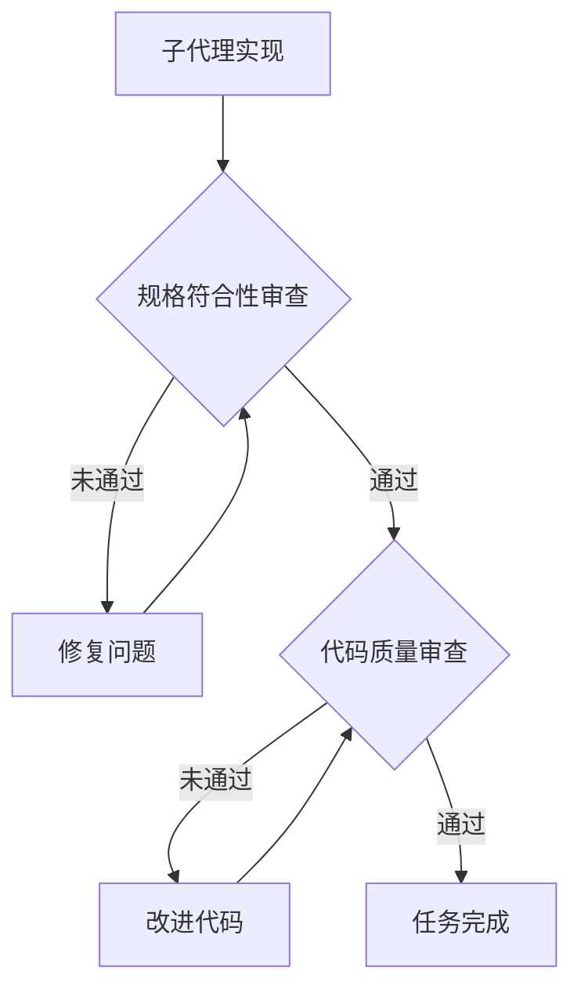
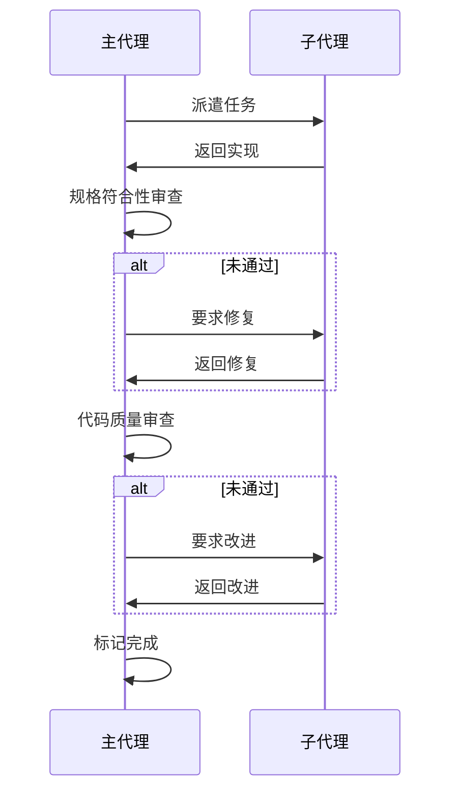

**Superpowers 是一个为 AI 编程代理（如 Claude Code、Codex、OpenCode）打造的完整软件开发工作流系统。** 它的核心理念是：通过一套可组合的"技能"和初始指令，让 AI 代理在编写代码时自动遵循最佳实践，而不是像"没有经验的初级工程师"那样随意行事。项目由 Jesse Vincent 开发，目前已获得 16k+ 星标。

<!-- more -->

## 问题背景

你是否遇到过这样的场景：让 AI 编程助手帮你实现一个功能，结果它：

- 跳过测试直接写代码
- 没看到测试失败就声称测试通过
- 擅自添加"优化"却不是你要求的
- 宣布完成但功能实际上有 bug

这些行为的共同点是：AI 像一个**热情但缺乏工程素养的初级工程师**——会写代码，但不懂得如何系统地、可靠地开发软件。

## 核心设计哲学

Superpowers 建立在四个核心原则之上：

| 原则 | 说明 |
|------|------|
| **测试驱动开发（TDD）** | 永远先写测试。没看到测试失败，就不能确定测试是否真正测试了正确行为 |
| **系统化而非临时化** | 用流程替代猜测。每个技能都有明确的决策流程图作为"可执行规范" |
| **复杂度削减** | 以简洁为首要目标，积极删除不必要的功能（YAGNI 原则） |
| **证据而非声明** | 必须验证后才能宣布完成——看到测试通过、代码运行，而不是"我觉得应该可以了" |

这些原则不是空话，而是被编码成 AI 必须遵循的工作流。

## 完整工作流程

Superpowers 构建了一个端到端的开发流程：


### 第一阶段：头脑风暴

当你说"我想做一个 X 功能"时，AI 不会直接写代码。它会像苏格拉底式对话一样：

1. **先侦察**：查看项目目录，了解现有代码结构
2. **一次问一个问题**：不会一次性抛出十个问题
3. **提供选项**：尽量给 A/B/C 选择，减少你的思考负担

设计方案以 200-300 字的小节呈现，每节都要确认"看起来对吗"。确认后写入 `docs/plans/` 目录。

### 第二阶段：工作区隔离

设计确认后，AI 会：

1. 创建新的 git 分支（如 `feature/todo-app`）
2. 创建独立的 worktree 目录
3. 验证项目环境和测试基线

这确保了开发环境隔离，不污染主分支。如果实验失败，直接删掉 worktree 即可。

### 第三阶段：编写计划

把设计拆解成 2-5 分钟的小任务，每个任务包含：

- 精确的文件路径
- 完整的代码片段
- 验证步骤

目标是让"一个没有判断力、没有项目背景的热情初级工程师"也能执行。

### 第四阶段：子代理驱动开发

这是 v4.0 的重大创新。主代理为每个任务派遣一个"新鲜"的子代理（没有上下文污染），实现后进行**两阶段审查**：



- **规格符合性审查**：代码是否完全符合需求？是否多做了或少做了？
- **代码质量审查**：代码是否干净？测试覆盖是否足够？

审查是循环的：发现问题 → 修复 → 再审查，直到通过。

### 第五阶段：收尾

所有任务完成后：

1. 验证测试全部通过
2. 呈现选项（合并/创建 PR/保留/丢弃）
3. 清理 worktree

## 技能库详解

项目包含 14 个核心技能，分为几大类别：

### 测试类

```
test-driven-development
```

强制执行 RED-GREEN-REFACTOR 循环。核心规则："先写测试失败的代码？删掉，重新来"。包含详细的反模式参考。

### 调试类

| 技能 | 说明 |
|------|------|
| `systematic-debugging` | 四阶段根因定位流程，整合逆向追踪调用栈、多层验证等技术 |
| `verification-before-completion` | 确保问题真正被修复 |

### 协作类

| 技能 | 说明 |
|------|------|
| `brainstorming` | 苏格拉底式设计提炼 |
| `writing-plans` | 详细实现计划 |
| `executing-plans` | 批量执行与检查点 |
| `dispatching-parallel-agents` | 并发子代理工作流 |
| `requesting-code-review` | 代码审查请求 |
| `receiving-code-review` | 代码审查响应 |
| `using-git-worktrees` | 并行开发分支 |
| `finishing-a-development-branch` | 合并/PR 决策工作流 |
| `subagent-driven-development` | 两阶段审查的快速迭代 |

### 元技能

| 技能 | 说明 |
|------|------|
| `using-superpowers` | 技能系统入门 |
| `writing-skills` | 如何创建新技能（包含测试方法论） |

## 技术架构亮点

### 流程图作为可执行规范

技能文件使用 DOT 语法定义决策流程图，这不是装饰性的，而是 AI 必须遵循的权威定义。

### 描述陷阱的发现与解决

项目团队发现一个有趣的现象：如果技能描述中包含工作流摘要，AI 会跟随简短描述而忽略详细流程图。

**解决方案**：描述只写触发条件（"Use when X"），不写流程细节。

### 反合理化设计

`using-superpowers` 技能中专门列出了 AI 常见的逃避借口及其反驳：

| AI 常见借口 | 反驳 |
|-------------|------|
| "我已经手动测试过了" | 错误，临时测试不等于系统化测试 |
| "这个测试太简单了不需要失败验证" | 错误，简单测试也可能写错 |
| "我知道这个功能能工作" | 证据？不是猜测 |

## 安装与使用

### Claude Code 安装

```bash
/plugin marketplace add obra/superpowers-marketplace
```

验证安装：

```bash
/help
```

你应该能看到：
- `/superpowers:brainstorm` - 头脑风暴
- `/superpowers:write-plan` - 写计划
- `/superpowers:execute-plan` - 执行计划

### Codex 安装

快速安装（推荐）：

```
Fetch and follow instructions from https://raw.githubusercontent.com/obra/superpowers/refs/heads/main/.codex/INSTALL.md
```

手动安装：

```bash
# 克隆仓库
mkdir -p ~/.codex/superpowers
git clone https://github.com/obra/superpowers.git ~/.codex/superpowers

# 创建个人技能目录
mkdir -p ~/.codex/skills

# 验证安装
~/.codex/superpowers/.codex/superpowers-codex bootstrap
```

### OpenCode 安装

```bash
#!/bin/bash
# 一键安装脚本

mkdir -p ~/.config/opencode/superpowers
git clone https://github.com/obra/superpowers.git ~/.config/opencode/superpowers

mkdir -p ~/.config/opencode/plugin
ln -sf ~/.config/opencode/superpowers/.opencode/plugin/superpowers.js \
       ~/.config/opencode/plugin/superpowers.js

mkdir -p ~/.config/opencode/skills
```

重启 OpenCode 后，输入 "do you have superpowers?" 验证安装。

## 使用示例

### 启动头脑风暴

你只需要说："我想做一个待办事项应用"

Superpowers 会自动触发，不需要输入特殊命令。AI 会：

1. 一次问一个问题厘清需求
2. 把设计分成小节展示确认
3. 全部确认后写入设计文档

### TDD 工作流

每个步骤遵循 RED-GREEN-REFACTOR 循环：

**RED（红色）**：写一个会失败的测试

```bash
npm test  # 失败（因为功能还不存在）
```

**关键**：必须亲眼看到测试失败！如果一开始就通过，说明测试写错了。

**GREEN（绿色）**：写最少的代码让测试通过

**REFACTOR（重构）**：清理代码，确保测试仍然通过

### 子代理审查

子代理完成实现后，主代理会进行审查：



## 常见问题

### Superpowers 与 GSD 有什么区别？

| 特性 | Superpowers | GSD |
|------|-------------|-----|
| 核心关注 | 技能系统、工程实践 | 上下文管理、工作流编排 |
| 技能机制 | 可组合的技能库 | 阶段式命令 |
| 审查流程 | 两阶段代码审查 | 验证阶段 |
| 适用场景 | 强调 TDD 和代码质量 | 强调项目管理和上下文保持 |

两者可以互补使用。

### 为什么必须看到测试失败？

这是 TDD 的核心实践：

1. 如果测试一开始就通过，可能测试的是已有功能（没意义）
2. 也可能测试写错了（危险，会给出错误的信心）
3. 只有看到测试失败，才能确保测试真正验证了预期行为

### 子代理为什么用"新鲜"的？

子代理没有之前的上下文污染，可以：

- 客观地执行任务，不会受之前对话的影响
- 没有已有的假设和偏见
- 审查时代理与实现时代理分离，确保审查的独立性

## 版本演进

| 版本 | 主要更新 |
|------|----------|
| v4.0 | 两阶段代码审查、调试技术整合 |
| v3.0 | 迁移到 Anthropic 官方技能系统 |
| v2.0 | 技能仓库分离，支持社区贡献 |

## 总结

Superpowers 本质上是在回答一个问题：**如何让 AI 代理像有经验的工程师一样工作，而不是像"会写代码但不懂工程"的实习生？**

答案是：把最佳实践编码成可执行的、不可逃避的工作流：

- 用流程图定义决策点
- 用测试验证行为
- 用子代理实现关注点分离
- 用两阶段审查确保质量

对于想要提升 AI 编程效率和质量的开发者，Superpowers 是一个值得学习和使用的工具。

## 参考资源

- [Superpowers GitHub 仓库](https://github.com/obra/superpowers)
- [Claude Code 官方文档](https://docs.anthropic.com/claude-code)