Go 语言能够轻松支持成千上万的并发 Goroutine，这背后的秘密就在于其高效的调度器。**GMP 模型**是 Go 调度器的核心设计，它实现了轻量级的用户态线程调度，让 Go 程序能够充分发挥多核 CPU 的性能。本文将深入剖析 GMP 模型的设计理念、核心组件、调度策略以及实战优化技巧。

<!-- more -->

## 简介

### 什么是 GMP 模型

GMP 模型是 Go 语言运行时调度器的核心设计，它定义了三种基本组件：

| 组件 | 全称 | 说明 |
|------|------|------|
| **G** | Goroutine | 协程，Go 中的轻量级线程 |
| **M** | Machine | 操作系统线程，由 OS 调度 |
| **P** | Processor | 逻辑处理器，包含运行 G 所需的资源 |

### 为什么需要 GMP 模型

在操作系统层面，线程是调度的基本单位，但线程存在以下问题：

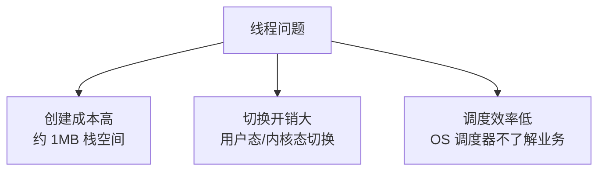

Go 的解决方案是 **M:N 线程模型**：

- **M 个 Goroutine** 映射到 **N 个 OS 线程**
- Goroutine 是用户态线程，由 Go 运行时调度
- 创建成本低（初始 2KB 栈空间），切换开销小

### GMP 模型的设计目标

| 目标 | 说明 |
|------|------|
| **轻量级** | Goroutine 创建成本低，可以创建大量协程 |
| **高效调度** | 用户态调度，避免频繁的内核态切换 |
| **多核利用** | 利用多核 CPU，实现真正的并行执行 |
| **公平调度** | 每个 Goroutine 都有机会执行，避免饥饿 |
| **扩展性好** | 随着核心数增加，性能线性提升 |

## GMP 核心组件详解

### G - Goroutine

Goroutine 是 Go 中的并发执行单元，每个 Goroutine 对应一个 G 结构体。

```go
// G 的核心字段（简化版）
type g struct {
    stack       stack    // 栈内存范围 [lo, hi)
    sched       gobuf    // 保存调度上下文（PC、SP 等）
    gopc        uintptr  // 创建该 G 的 PC
    status      uint32   // 状态：_Gidle, _Grunnable, _Grunning 等
    goid        int64    // Goroutine ID
    m           *m       // 当前绑定的 M
    waitreason  string   // 等待原因
}
```

**G 的状态流转：**

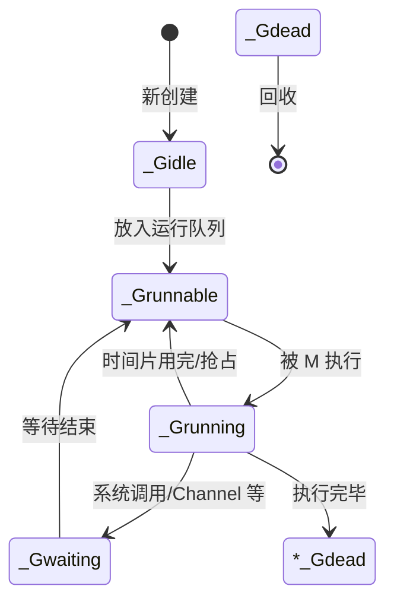

**G 的状态说明：**

| 状态 | 说明 |
|------|------|
| `_Gidle` | 刚创建，尚未初始化 |
| `_Grunnable` | 在运行队列中，等待运行 |
| `_Grunning` | 正在执行 |
| `_Gwaiting` | 被阻塞（如 Channel、IO、锁等） |
| `_Gsyscall` | 正在执行系统调用 |
| `_Gdead` | 执行完毕，等待回收 |

### M - Machine

M 是操作系统线程的抽象，代表一个真正的执行线程。

```go
// M 的核心字段（简化版）
type m struct {
    g0       *g      // 特殊的 G，用于执行调度代码
    curg     *g      // 当前运行的 G
    p        *p      // 绑定的 P
    nextp    *p      // 即将绑定的 P
    spinning bool    // 是否处于自旋状态（正在寻找 G）
    blocked  bool    // 是否被阻塞
    park     note    // 休眠唤醒机制
}
```

**M 的特点：**

- M 是真正的 OS 线程，由操作系统调度
- 每个 M 都有一个特殊的 `g0`，用于执行调度代码
- M 需要绑定 P 才能执行 G
- M 的数量可以动态增减

**g0 的作用：**

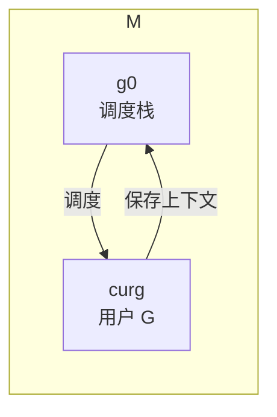

- `g0` 使用系统栈（约 8KB），用于执行调度、系统调用等
- 用户 G 使用自己的栈（初始 2KB，可增长）
- 调度时会切换到 `g0` 栈执行

### P - Processor

P 是逻辑处理器，持有运行 G 所需的资源（如本地运行队列）。

```go
// P 的核心字段（简化版）
type p struct {
    id          int32       // P 的 ID
    status      uint32      // 状态：_Pidle, _Prunning 等
    m           *m          // 绑定的 M
    runqhead    uint32      // 本地运行队列头
    runqtail    uint32      // 本地运行队列尾
    runq        [256]*g     // 本地运行队列（环形队列）
    runnext     *g          // 优先运行的 G
    gFree       *g          // 空闲 G 列表（复用）
    gcBgMarkWorker *g       // GC 后台标记 Worker
}
```

**P 的状态：**

| 状态 | 说明 |
|------|------|
| `_Pidle` | 空闲，未绑定 M |
| `_Prunning` | 运行中，已绑定 M |
| `_Psyscall` | M 正在执行系统调用 |
| `_Pgcstop` | GC 期间停止 |
| `_Pdead` | 不再使用 |

**P 的作用：**

1. **本地运行队列**：每个 P 有一个本地队列（最多 256 个 G）
2. **资源隔离**：P 持有运行 G 所需的资源，减少锁竞争
3. **工作窃取**：P 之间可以窃取 G，实现负载均衡

### GMP 的关系

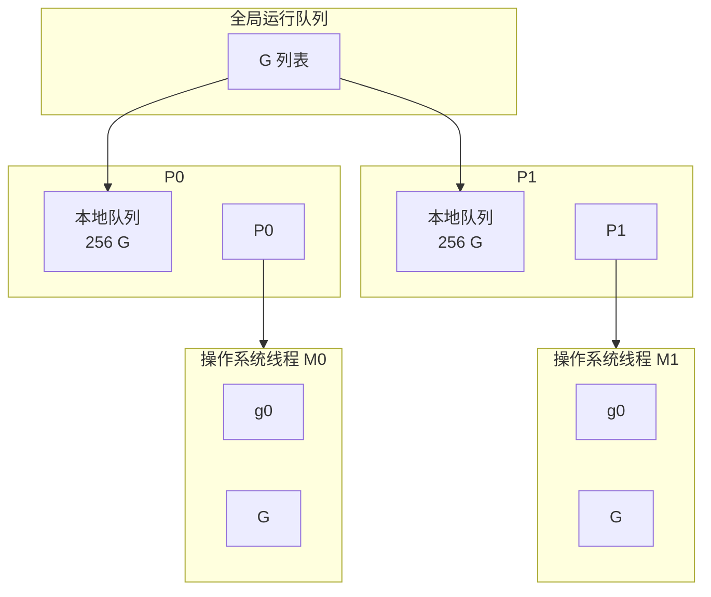

**核心关系：**

- 一个 M 必须绑定一个 P 才能执行 G
- 一个 P 在同一时刻只能绑定一个 M
- P 的数量默认等于 CPU 核心数（`GOMAXPROCS`）
- M 的数量可以大于 P 的数量（处理系统调用）

## 调度器工作原理

### 调度循环

M 的执行过程是一个循环：**找 G → 执行 G → 保存上下文 → 找下一个 G**。

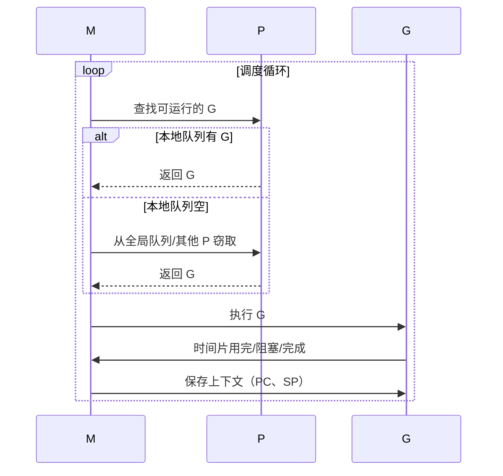

### 查找 G 的顺序

调度器按以下优先级查找可运行的 G：

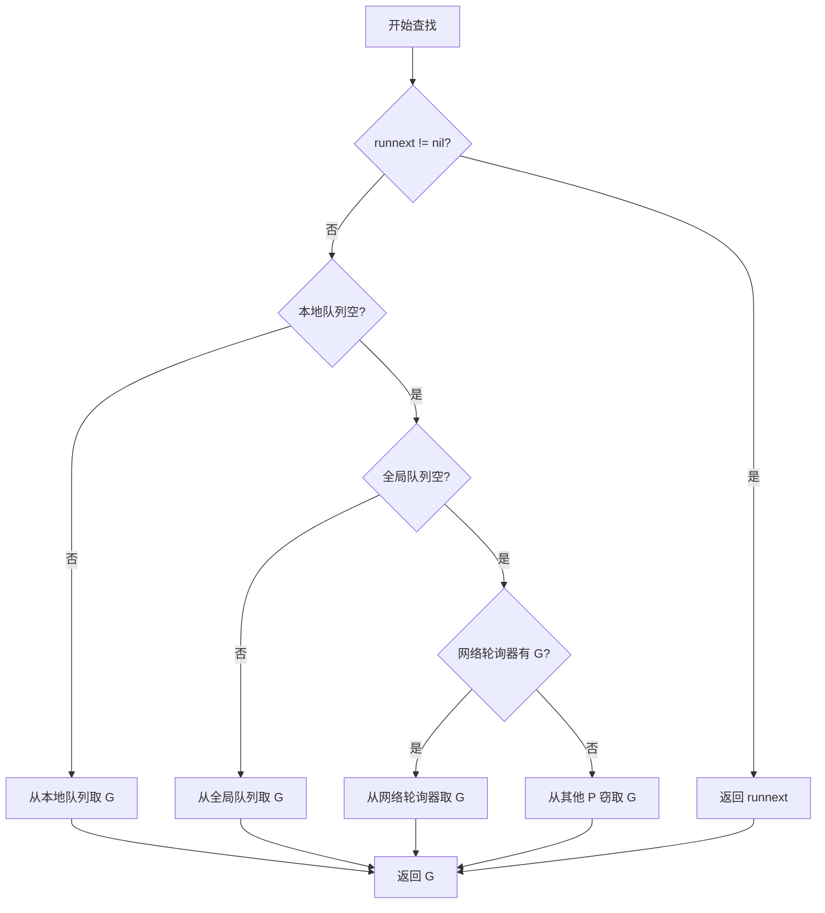

**详细说明：**

1. **runnext**：最近创建的 G，优先级最高
2. **本地队列**：当前 P 的本地队列，无锁访问
3. **全局队列**：所有 P 共享，需要加锁
4. **网络轮询器**：网络 IO 就绪的 G
5. **工作窃取**：从其他 P 的本地队列窃取一半

### 调度时机

以下情况会触发调度：

| 触发点 | 说明 |
|--------|------|
| `go func()` | 创建新的 Goroutine |
| `time.Sleep` | Goroutine 休眠 |
| `channel` 操作 | 发送/接收阻塞 |
| `select` | 多路复用阻塞 |
| `sync.Mutex` | 锁竞争阻塞 |
| `runtime.Gosched()` | 主动让出 CPU |
| 系统调用 | 进入/退出系统调用 |
| 抢占式调度 | GC 或监控线程抢占 |

### 上下文切换

当 G 被切换出去时，需要保存其执行上下文：

```go
// gobuf 保存 G 的调度信息
type gobuf struct {
    sp   uintptr  // 栈指针
    pc   uintptr  // 程序计数器
    g    guintptr // 指向 G
    ret  uintptr  // 返回值
}
```

**切换过程：**

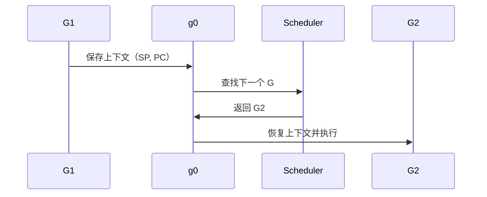

## 调度策略详解

### 工作窃取（Work Stealing）

当本地队列为空时，P 会尝试从其他 P 窃取 G。

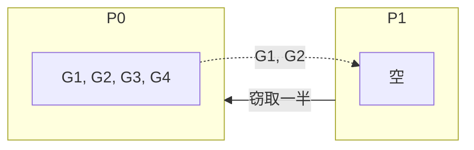

**窃取规则：**

- 从其他 P 的本地队列尾部窃取一半（最多 32 个）
- 随机选择一个 P 开始尝试
- 如果窃取失败，继续尝试其他 P
- 所有 P 都窃取失败后，检查全局队列和网络轮询器

### 系统调用处理

当 M 执行系统调用时，会阻塞 OS 线程。Go 的处理策略是 **Hand off** 机制。

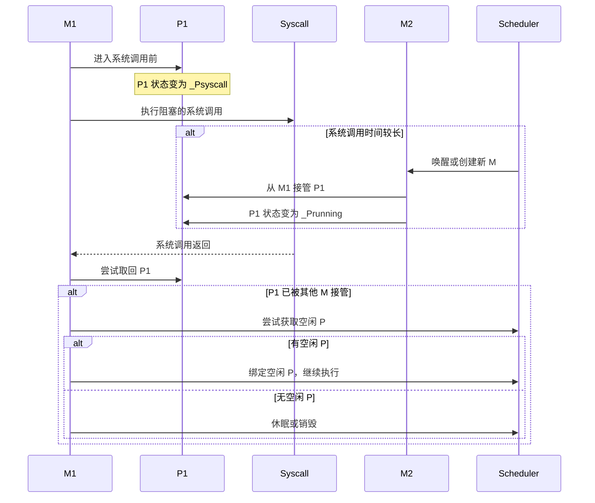

**关键点：**

1. **进入系统调用**：M 释放 P，P 进入 `_Psyscall` 状态
2. **系统调用期间**：其他 M 可以接管 P，继续执行其他 G
3. **退出系统调用**：M 尝试取回原来的 P，或获取其他空闲 P

### 抢占式调度

Go 1.14 引入了基于信号的异步抢占，解决了长时间运行的 G 饿死其他 G 的问题。

**抢占触发条件：**

1. **GC 栈扫描**：发现 G 运行时间超过 10ms
2. **系统监控**：发现 G 运行时间过长
3. **内存分配**：内存分配失败需要触发 GC

**抢占流程：**

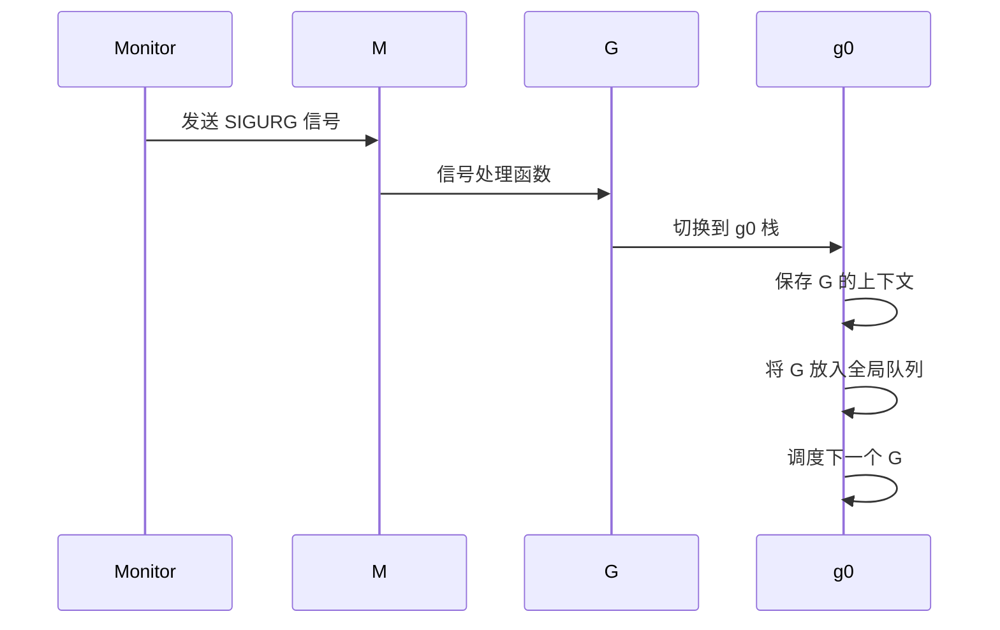

### 公平调度

Go 调度器通过以下机制保证公平性：

| 机制 | 说明 |
|------|------|
| **时间片轮转** | 每个 G 最多连续执行 10ms |
| **抢占式调度** | 长时间运行的 G 会被抢占 |
| **全局队列优先** | 每 61 次调度从全局队列取 G |
| **工作窃取** | 负载不均时自动平衡 |

```go
// 简化的调度代码
func schedule() {
    // 每 61 次调度，优先从全局队列取 G
    if schedCount%61 == 0 {
        if gp := globrunqget(_p_, 1); gp != nil {
            return gp
        }
    }
    // ...
}
```

## 调度器生命周期

### 启动过程

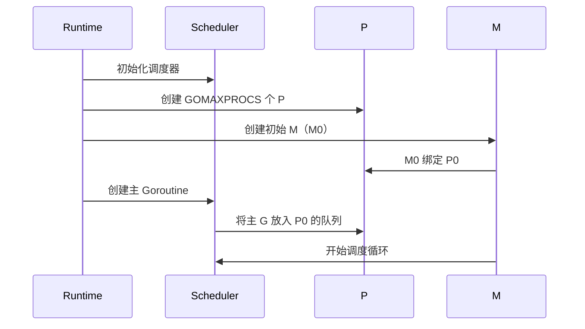

### Goroutine 创建

```go
// go func() 的实现（简化版）
func newproc(fn *funcval) {
    // 1. 从 P 的空闲列表获取 G，或新建 G
    gp := gfget(_p_)
    if gp == nil {
        gp = malg(_StackMin)  // 分配 2KB 栈
    }

    // 2. 初始化 G
    gp.sched.pc = fn.pc
    gp.sched.sp = gp.stack.hi

    // 3. 放入运行队列
    runqput(_p_, gp, true)  // true 表示放入 runnext
}
```

### Goroutine 结束

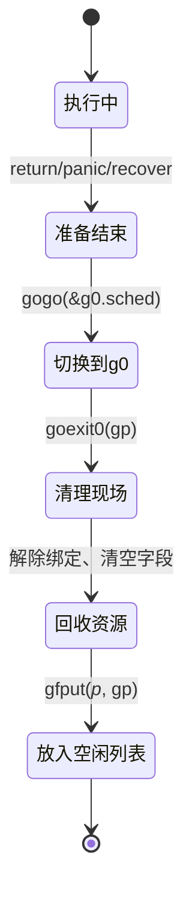

## 实战分析

### 查看调度信息

使用 `GODEBUG` 环境变量可以查看调度器的详细信息：

```bash
# 显示调度器详细信息
GODEBUG=schedtrace=1000 ./myprogram

# 输出示例
SCHED 1000ms: gomaxprocs=8 idleprocs=0 threads=10 spinningthreads=1 idlethreads=0 runqueue=0 [0 0 0 0 0 0 0 0]
```

**输出解释：**

| 字段 | 说明 |
|------|------|
| `gomaxprocs` | P 的数量 |
| `idleprocs` | 空闲 P 的数量 |
| `threads` | M 的数量 |
| `spinningthreads` | 自旋 M 的数量 |
| `idlethreads` | 空闲 M 的数量 |
| `runqueue` | 全局队列中的 G 数量 |
| `[...]` | 每个 P 的本地队列中的 G 数量 |

### 使用 pprof 分析

```go
import (
    _ "net/http/pprof"
    "net/http"
)

func main() {
    go func() {
        http.ListenAndServe("localhost:6060", nil)
    }()

    // 你的程序...
}
```

```bash
# 查看 Goroutine 数量和状态
curl http://localhost:6060/debug/pprof/goroutine?debug=1

# 使用 go tool pprof 分析
go tool pprof http://localhost:6060/debug/pprof/goroutine
```

### 追踪调度事件

使用 `runtime/trace` 包追踪调度事件：

```go
import (
    "runtime/trace"
    "os"
)

func main() {
    f, _ := os.Create("trace.out")
    defer f.Close()

    trace.Start(f)
    defer trace.Stop()

    // 你的程序...
}
```

```bash
# 生成追踪文件后，使用 go tool trace 分析
go tool trace trace.out
```

## 性能优化建议

### 1. 合理设置 GOMAXPROCS

```go
// 默认等于 CPU 核心数
// 在容器环境中可能需要手动设置
import "runtime"

func init() {
    runtime.GOMAXPROCS(4)  // 设置为 4 个 P
}
```

{}
在 Kubernetes 容器环境中，`GOMAXPROCS` 默认等于宿主机的 CPU 核心数，可能导致严重的上下文切换开销。建议使用 `automaxprocs` 库自动获取容器的 CPU 限制。
{}

```go
// 使用 automaxprocs 自动设置
import _ "go.uber.org/automaxprocs"
```

### 2. 避免 Goroutine 泄漏

```go
// ❌ 错误示例：Goroutine 泄漏
func leak() {
    ch := make(chan int)
    go func() {
        <-ch  // 永远阻塞，因为没有人发送数据
    }()
    // 函数返回，但 Goroutine 仍在运行
}

// ✅ 正确示例：使用 context 取消
func noLeak(ctx context.Context) {
    ch := make(chan int)
    go func() {
        select {
        case <-ch:
            // 处理数据
        case <-ctx.Done():
            return  // 提前退出
        }
    }()
}
```

### 3. 控制并发数量

```go
// ❌ 错误示例：无限制创建 Goroutine
func processAll(items []Item) {
    for _, item := range items {
        go process(item)  // 可能创建数百万个 Goroutine
    }
}

// ✅ 正确示例：使用工作池
func processAll(items []Item, workers int) {
    sem := make(chan struct{}, workers)
    var wg sync.WaitGroup

    for _, item := range items {
        wg.Add(1)
        go func(item Item) {
            defer wg.Done()
            sem <- struct{}{}  // 获取信号量
            defer func() { <-sem }()  // 释放信号量
            process(item)
        }(item)
    }
    wg.Wait()
}
```

### 4. 避免频繁创建销毁 Goroutine

```go
// ❌ 错误示例：每次请求创建新 Goroutine
func handleRequest(req Request) {
    go func() {
        process(req)
    }()
}

// ✅ 正确示例：使用 Goroutine 池
var pool = &sync.Pool{
    New: func() interface{} {
        return new(Worker)
    },
}

func handleRequest(req Request) {
    w := pool.Get().(*Worker)
    defer pool.Put(w)
    w.process(req)
}
```

### 5. 避免在循环中创建闭包

```go
// ❌ 错误示例：所有 Goroutine 捕获同一个变量
for i := 0; i < 10; i++ {
    go func() {
        fmt.Println(i)  // 可能全部打印 10
    }()
}

// ✅ 正确示例：传递参数
for i := 0; i < 10; i++ {
    go func(n int) {
        fmt.Println(n)
    }(i)
}
```

### 6. 使用 sync.WaitGroup 等待 Goroutine

```go
func processConcurrently(items []Item) error {
    var wg sync.WaitGroup
    errCh := make(chan error, len(items))

    for _, item := range items {
        wg.Add(1)
        go func(item Item) {
            defer wg.Done()
            if err := process(item); err != nil {
                errCh <- err
            }
        }(item)
    }

    wg.Wait()
    close(errCh)

    // 返回第一个错误
    for err := range errCh {
        return err
    }
    return nil
}
```

## 常见问题

### Q1: Goroutine 和线程的区别

| 特性 | Goroutine | OS 线程 |
|------|-----------|---------|
| 栈空间 | 2KB 起，动态增长 | 固定 ~1MB |
| 创建开销 | 微秒级 | 毫秒级 |
| 切换开销 | 用户态切换，纳秒级 | 内核态切换，微秒级 |
| 调度器 | Go 运行时 | 操作系统 |
| 数量限制 | 可以创建数百万 | 通常数千个 |
| 切换方式 | 协作式 + 抢占式 | 抢占式 |

### Q2: 如何查看当前 Goroutine 数量

```go
import "runtime"

func main() {
    fmt.Printf("Goroutine 数量: %d\n", runtime.NumGoroutine())
}
```

### Q3: 为什么需要 P

P 的引入（Go 1.1）解决了以下问题：

1. **资源隔离**：每个 P 有独立的本地队列，减少锁竞争
2. **工作窃取**：实现负载均衡
3. **缓存亲和性**：G 倾向于在同一个 P 上运行

### Q4: 如何判断调度器是否健康

观察以下指标：

```bash
# 使用 GODEBUG 查看调度信息
GODEBUG=schedtrace=1000,scheddetail=1 ./myprogram
```

健康指标：

| 指标 | 正常范围 | 异常情况 |
|------|----------|----------|
| `runqueue` | 0 或很小 | 持续很大，调度器压力大 |
| `idleprocs` | 有空闲 P | 持续为 0，CPU 使用率高 |
| `threads` | 合理数量 | 持续增长，可能有泄漏 |
| `spinningthreads` | 0 或 1 | 过高，CPU 浪费 |

### Q5: 如何避免调度器抖动

**原因**：G 频繁在不同 P 之间迁移，导致缓存失效。

**解决方案**：

```go
// 使用 runtime.LockOSThread 将 G 绑定到当前 M
func main() {
    runtime.LockOSThread()
    defer runtime.UnlockOSThread()

    // 这段代码始终在同一个 OS 线程上执行
    // 适用于需要线程局部存储或特定 CPU 亲和性的场景
}
```

## 总结

GMP 模型是 Go 语言高并发能力的基石，理解它对于编写高效的 Go 程序至关重要。

**核心要点：**

- **G (Goroutine)**：轻量级协程，用户态线程，创建成本低
- **M (Machine)**：操作系统线程，真正执行代码
- **P (Processor)**：逻辑处理器，持有运行资源，实现工作窃取

**调度策略：**

- **工作窃取**：负载均衡，P 之间可以窃取 G
- **系统调用处理**：Hand off 机制，避免 M 阻塞影响其他 G
- **抢占式调度**：基于信号的异步抢占，保证公平性
- **公平调度**：时间片轮转、全局队列优先

**优化建议：**

1. 合理设置 `GOMAXPROCS`，容器环境使用 `automaxprocs`
2. 避免 Goroutine 泄漏，使用 `context` 取消
3. 控制并发数量，使用工作池或信号量
4. 避免频繁创建销毁 Goroutine
5. 注意闭包变量捕获问题
6. 使用 `sync.WaitGroup` 等待 Goroutine 完成

理解 GMP 模型的工作原理，能够帮助你更好地诊断和解决 Go 程序中的并发问题，编写出更高效的并发代码。

## 参考资源

- [Go 调度器设计文档](https://golang.org/src/runtime/proc.go)
- [Go 调度器设计原理](https://docs.google.com/document/d/1TTj4T2JO42uD5ID9e89oa0sLKhJYD0Y_kqxDv3I3XMw)
- [Go 语言设计与实现 - 调度器](https://draveness.me/golang/docs/part3-runtime/ch06-concurrency/golang-goroutine/)
- [Scalable Go Scheduler Design Doc](https://golang.org/s/go11sched)
