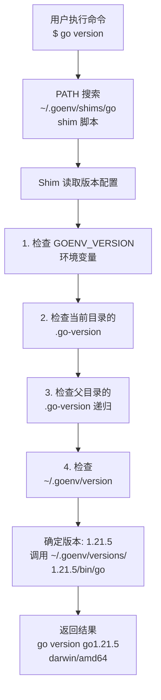

在 Golang 开发过程中，经常需要在不同项目间切换使用不同版本的 Go。有的项目依赖 Go 1.18，有的需要 Go 1.21，还有的可能要测试最新的 Go 1.22 beta 版本。手动安装和切换多个 Go 版本不仅繁琐，还容易出错。**goenv** 是一个简单高效的 Golang 多版本管理工具，它借鉴了 rbenv 和 pyenv 的设计理念，通过 shim 机制实现了优雅的版本切换。

<!-- more -->

## 简介

### 什么是 goenv

**goenv**（syndbg/goenv）是一个 Golang 多版本管理工具，允许用户在同一台机器上安装、管理和切换多个 Go 版本。它的设计灵感来自于 Ruby 的 rbenv 和 Python 的 pyenv，因此如果你熟悉这些工具，goenv 的使用方式会让你倍感亲切。

### 核心特性

| 特性 | 说明 |
|------|------|
| **Shim 机制** | 通过轻量级 shim 脚本拦截 Go 命令，自动路由到正确的版本 |
| **项目级版本隔离** | 支持通过 `.go-version` 文件为每个项目指定独立的 Go 版本 |
| **多层级版本控制** | 支持全局、目录、shell 会话三个层级的版本设置 |
| **简单易用** | 命令直观，学习曲线平缓 |
| **跨平台支持** | 支持 Linux、macOS 和 WSL |

### 与其他工具对比

| 特性 | goenv | gvm | g (voidint/g) |
|------|-------|-----|---------------|
| 实现语言 | Shell + Bash | Bash | Go |
| 架构 | Shim 机制 | 虚拟环境 | 直接管理 |
| 安装复杂度 | 简单 | 中等 | 简单 |
| 跨平台支持 | Linux/macOS/WSL | Linux/macOS | Linux/macOS/Windows |
| 项目级版本 | 支持（.go-version） | 支持（pkgset） | 支持 |
| 镜像支持 | 无 | 无 | 有（国内加速） |
| 学习曲线 | 低 | 中 | 中 |

**goenv 的优势**：如果你已经熟悉 pyenv 或 rbenv，goenv 提供了一致的使用体验；架构简单清晰，性能优秀；适合追求轻量级和稳定性的用户。

## 安装

### Git 克隆安装（推荐）

这是最通用的安装方式，适用于所有支持的系统。

```bash
# 克隆 goenv 仓库到 ~/.goenv
git clone https://github.com/syndbg/goenv.git ~/.goenv
```

### Homebrew 安装（macOS）

macOS 用户可以通过 Homebrew 简化安装过程：

```bash
brew install goenv
```

### 配置环境变量

安装完成后，需要配置环境变量。根据你使用的 shell 进行配置：

**对于 Bash 用户：**

```bash
# 添加到 ~/.bashrc
echo 'export GOENV_ROOT="$HOME/.goenv"' >> ~/.bashrc
echo 'export PATH="$GOENV_ROOT/bin:$PATH"' >> ~/.bashrc
echo 'eval "$(goenv init -)"' >> ~/.bashrc

# 使配置生效
source ~/.bashrc
```

**对于 Zsh 用户：**

```bash
# 添加到 ~/.zshrc
echo 'export GOENV_ROOT="$HOME/.goenv"' >> ~/.zshrc
echo 'export PATH="$GOENV_ROOT/bin:$PATH"' >> ~/.zshrc
echo 'eval "$(goenv init -)"' >> ~/.zshrc

# 使配置生效
source ~/.zshrc
```

### 验证安装

```bash
# 检查 goenv 版本
goenv --version

# 查看 goenv 安装路径
which goenv

# 列出所有可用命令
goenv commands
```

## 核心概念

### Shim 机制

Shim（垫片）是 goenv 的核心机制。当你在终端输入 `go version` 时，实际执行流程如下：

```
用户执行 'go version'
    ↓
PATH 中找到 ~/.goenv/shims/go
    ↓
Shim 读取配置确定目标版本
    ↓
调用 ~/.goenv/versions/1.21.5/bin/go
    ↓
返回结果给用户
```

Shim 的优势在于：
- 无需频繁修改环境变量
- 版本切换透明且即时生效
- 支持项目级版本隔离

### 版本优先级

goenv 按以下优先级确定使用的 Go 版本（优先级从高到低）：

```
环境变量 GOENV_VERSION >
当前目录的 .go-version 文件 >
父目录的 .go-version 文件（递归查找）>
~/.goenv/version 全局配置
```

### 目录结构

goenv 安装后的目录结构：

```
~/.goenv/
├── bin/           # goenv 可执行文件
├── shims/         # shim 可执行文件目录
├── versions/      # 已安装的 Go 版本
│   ├── 1.20.12/
│   ├── 1.21.5/
│   └── 1.22.3/
└── version        # 当前全局版本
```

## 常用命令

### 版本安装

```bash
# 列出所有可用的 Go 版本
goenv install --list
# 或使用简写
goenv install -l

# 安装特定版本
goenv install 1.21.5
goenv install 1.22.3
```

### 版本切换

```bash
# 设置全局默认版本
goenv global 1.22.3

# 设置当前目录/项目的版本（生成 .go-version 文件）
goenv local 1.21.5

# 设置当前 shell 会话的版本
goenv shell 1.20.12
```

### 版本查看

```bash
# 列出已安装的所有版本
goenv versions

# 查看当前激活的版本
goenv version

# 显示 Go 可执行文件的完整路径
goenv which go
```

### 其他命令

| 命令 | 说明 |
|------|------|
| `goenv uninstall <version>` | 卸载指定版本 |
| `goenv rehash` | 刷新 shim（通常自动执行） |
| `goenv prefix` | 显示 Go 版本的安装目录 |
| `goenv root` | 显示 goenv 根目录 |
| `goenv --help` | 显示帮助信息 |

```bash
# 卸载不需要的版本
goenv uninstall 1.20.12

# 手动刷新 shim
goenv rehash
```

## 实战案例

### 场景：多项目多版本管理

假设你有三个项目，分别需要不同的 Go 版本：

```bash
# 项目 A 需要 Go 1.20
cd ~/projects/project-a
goenv local 1.20.12

# 项目 B 需要 Go 1.21
cd ~/projects/project-b
goenv local 1.21.5

# 设置全局默认为 Go 1.22（用于其他项目）
goenv global 1.22.3

# 验证版本切换
cd ~/projects/project-a && go version
# 输出: go version go1.20.12 darwin/amd64

cd ~/projects/project-b && go version
# 输出: go version go1.21.5 darwin/amd64

cd ~ && go version
# 输出: go version go1.22.3 darwin/amd64
```

每个项目目录下会生成一个 `.go-version` 文件：

```bash
# 查看 project-a 的版本配置
cat ~/projects/project-a/.go-version
# 输出: 1.20.12
```

### 场景：CI/CD 环境配置

在持续集成环境中使用 goenv 管理特定 Go 版本：

```bash
# 在 CI 中安装 goenv
git clone https://github.com/syndbg/goenv.git ~/.goenv
export GOENV_ROOT="$HOME/.goenv"
export PATH="$GOENV_ROOT/bin:$PATH"
eval "$(goenv init -)"

# 安装项目所需的 Go 版本
goenv install 1.21.5
goenv global 1.21.5

# 验证并构建
go version
go build
```

## 配置详解

### 环境变量

| 环境变量 | 说明 | 默认值 |
|----------|------|--------|
| `GOENV_ROOT` | goenv 安装目录 | `~/.goenv` |
| `GOENV_VERSION` | 强制指定 Go 版本 | 无 |
| `GOENV_DEBUG` | 启用调试输出 | 空（关闭） |

### 配置文件

**~/.goenv/version** - 存储全局默认的 Go 版本：

```bash
# 查看全局版本
cat ~/.goenv/version
# 输出: 1.22.3
```

**.go-version** - 项目级版本配置文件：

```bash
# 在项目目录执行
cd /path/to/project
goenv local 1.21.5

# 生成 .go-version 文件
cat .go-version
# 输出: 1.21.5
```

### Shim 工作原理详解



## 常见问题

### goenv 命令未找到

**现象**：执行 `goenv` 时提示 "command not found"

**解决方法**：

```bash
# 检查 PATH 是否包含 goenv
echo $PATH | grep goenv

# 检查 goenv 是否正确安装
ls -la ~/.goenv

# 重新加载配置
source ~/.bashrc  # 或 ~/.zshrc

# 验证安装
which goenv
```

### 版本切换不生效

**现象**：执行 `goenv global` 或 `goenv local` 后，`go version` 仍显示旧版本

**解决方法**：

```bash
# 检查 .go-version 文件
cat .go-version

# 查看当前激活的版本
goenv version

# 手动刷新 shim
goenv rehash

# 检查 PATH 优先级
echo $PATH | tr ':' '\n' | grep goenv
```

### Go 安装失败

**现象**：`goenv install` 执行失败或卡住

**解决方法**：

```bash
# 检查网络连接
curl -I https://golang.org/dl/

# 清理缓存
rm -rf ~/.goenv/cache

# 重新安装
goenv install 1.21.5
```

### 卸载 goenv

如果需要完全卸载 goenv：

```bash
# 删除 goenv 目录
rm -rf ~/.goenv

# 从配置文件中移除相关行
# 编辑 ~/.bashrc 或 ~/.zshrc，删除以下行：
# export GOENV_ROOT="$HOME/.goenv"
# export PATH="$GOENV_ROOT/bin:$PATH"
# eval "$(goenv init -)"
```

## 最佳实践

### 项目版本管理

1. **始终使用 `.go-version` 文件**：为每个项目指定固定的 Go 版本，确保团队成员使用一致的环境
2. **提交 `.go-version` 到版本控制**：将此文件纳入 Git 管理
3. **合理设置全局版本**：将全局版本设置为你最常用的 Go 版本

```bash
# .gitignore 示例
# 不要忽略 .go-version 文件
# .go-version

# 可以忽略其他本地配置
.DS_Store
```

### CI/CD 集成建议

1. **缓存 goenv 目录**：在 CI 中缓存 `~/.goenv` 以加速构建
2. **明确指定版本**：使用 `goenv local` 锁定项目版本
3. **验证版本**：构建前验证 Go 版本是否正确

```yaml
# GitLab CI 示例
before_script:
  - export GOENV_ROOT="$HOME/.goenv"
  - export PATH="$GOENV_ROOT/bin:$PATH"
  - eval "$(goenv init -)"
  - goenv install $(cat .go-version)
  - goenv global $(cat .go-version)
  - go version
```

### 团队协作

1. **统一使用 goenv**：团队内部统一使用相同的版本管理工具
2. **文档化版本要求**：在项目 README 中说明所需的 Go 版本
3. **自动化检查**：可以添加 pre-commit hook 检查 Go 版本

## 总结

goenv 是一个简洁而强大的 Golang 多版本管理工具。通过 shim 机制，它实现了优雅的版本切换，无需频繁修改环境变量。其核心优势包括：

- **简单易用**：命令直观，学习曲线平缓
- **项目级隔离**：支持为每个项目设置独立的 Go 版本
- **透明切换**：版本切换即时生效，无需重启终端
- **跨平台支持**：在 Linux、macOS 和 WSL 上都能良好运行

如果你已经熟悉 pyenv 或 rbenv，goenv 将提供一致的体验。对于需要管理多个 Go 版本的开发者来说，goenv 是一个值得推荐的选择。

## 参考资源

- [syndbg/goenv - GitHub](https://github.com/syndbg/goenv)
- [Go Official Downloads](https://golang.org/dl/)
- [Effective Go](https://golang.org/doc/effective_go)
