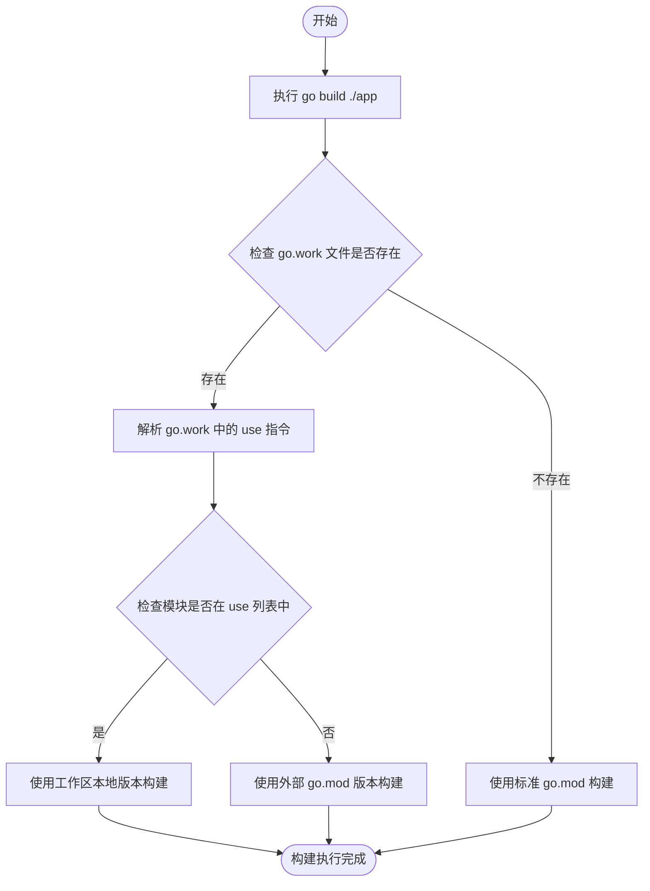
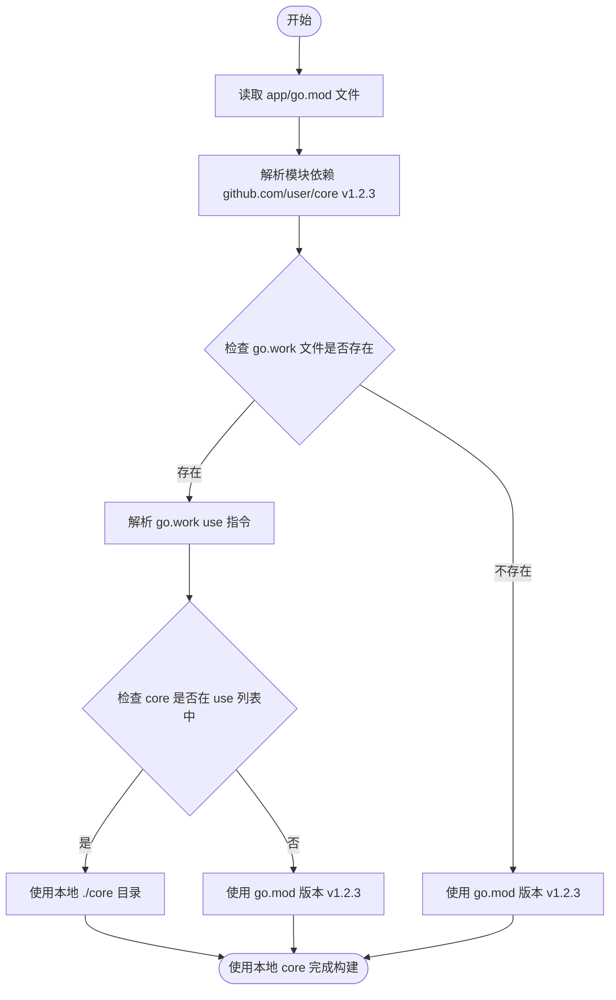

在 Go 多模块项目开发中，经常需要同时修改多个相互依赖的模块。传统的做法是使用 `replace` 指令或在本地进行 `go get` 替换，但这些方法都有其局限性。**Go Work（工作区）** 是 Go 1.18 引入的多模块开发功能，它允许开发者在不修改 `go.mod` 文件的情况下，同时工作于多个模块，极大简化了多模块开发的复杂度。

<!-- more -->

在 Go 语言开发中，多模块项目的管理一直是个挑战。当你需要同时修改一个库和使用该库的应用程序时，传统的方法需要频繁修改 `go.mod` 文件中的 `replace` 指令，这不仅繁琐，还容易在提交时引入错误。Go Workspaces（工作区）是 Go 1.18 引入的解决方案，通过 `go.work` 文件实现了优雅的多模块开发支持。

### 简介

**Go Work**（工作区）是 Go 1.18 引入的多模块开发模式，通过 `go.work` 文件实现跨模块的开发支持。它允许开发者在同一个工作区内同时处理多个相关的 Go 模块，无需修改各个模块的 `go.mod` 文件中的依赖关系。

**核心特性：**

| 特性 | 说明 |
|------|------|
| **零侵入性** | 无需修改各模块的 `go.mod` 文件 |
| **多模块支持** | 同时工作于多个相关模块 |
| **依赖替换** | 自动使用本地模块版本替代远程依赖 |
| **IDE 友好** | 主流 IDE 完美支持工作区模式 |
| **版本管理** | 支持指定模块的具体版本或提交 |
| **临时环境** | 工作区配置不影响实际部署 |

**与传统方法对比：**

| 特性 | Go Work | replace 指令 | 本地 go get |
|------|---------|--------------|-------------|
| 修改 go.mod | 不需要 | 需要 | 需要 |
| 临时性 | 天然临时 | 需手动清理 | 需手动清理 |
| 多模块支持 | 原生支持 | 需多条 replace | 需多次操作 |
| 版本控制 | 不提交 go.work | 提交 go.mod | 提交 go.mod |
| 学习曲线 | 低 | 低 | 中 |

Go Work 特别适合多模块仓库（monorepo）的开发，或同时修改库和使用该库的应用程序场景。

### 快速开始

#### 基本概念

Go Work 通过 `go.work` 文件管理工作区，该文件通常包含：
- **Go 版本声明**
- **工作区包含的模块目录**
- **可选的替换指令**

#### 创建工作区

假设你有以下项目结构：

```bash
# 项目结构
~/projects/
├── myapp/          # 应用程序模块
│   ├── go.mod
│   └── main.go
└── mylib/          # 库模块
    ├── go.mod
    └── util.go
```

创建工作区：

```bash
# 进入项目根目录
cd ~/projects

# 创建工作区文件
go work init

# 添加模块到工作区
go work use ./myapp
go work use ./mylib
```

生成的 `go.work` 文件：

```go
go 1.21

use (
    ./myapp
    ./mylib
)
```

#### 验证工作区

```bash
# 在 myapp 中引用 mylib
cd myapp
go mod tidy

# 查看依赖关系
go list -m all

# 运行程序（自动使用工作区中的 mylib）
go run main.go
```

### 核心概念

#### 工作区文件结构

`go.work` 文件的完整语法：

```go
go 1.21

// 使用目录中的模块
use ./path/to/module

// 使用特定版本的模块
use (
    ./module1
    ./module2
)

// 替换指令（可选）
replace (
    // 替换为本地目录
    example.com/mod => ../mod

    // 替换为特定版本
    example.com/other => v1.2.3
)
```

#### 工作区解析优先级

Go 工具链在解析模块时按以下优先级：

```
go.work 中的 use 指令 >
go.work 中的 replace 指令 >
go.mod 中的 replace 指令 >
最新版本
```

#### 目录结构示例

典型的多模块工作区：

```
workspace/
├── go.work              # 工作区配置文件
├── app/                 # 应用程序
│   ├── go.mod
│   └── main.go
├── core/                # 核心库
│   ├── go.mod
│   └── core.go
├── utils/               # 工具库
│   ├── go.mod
│   └── helpers.go
└── proto/               # Protocol Buffers 定义
    ├── go.mod
    └── definitions.proto
```

### 常用命令

#### 初始化工作区

```bash
# 创建新的工作区
go work init

# 创建并指定模块
go work init ./app ./core
```

#### 管理工作区模块

```bash
# 添加模块到工作区
go work use ./utils

# 添加多个模块
go work use ./app ./core ./utils

# 移除模块（重新编辑 go.work 文件）
# 或使用编辑器手动删除 use 指令
```

#### 查看工作区信息

```bash
# 查看工作区使用的所有模块
go work use

# 查看模块的依赖关系
go list -m all

# 查看特定模块信息
go list -m -f '{{.Dir}}' example.com/module
```

#### 同步与维护

```bash
# 下载工作区中所有模块的依赖
go work sync

# 编辑 go.work 文件
go work edit

# 验证工作区配置
go work verify
```

### 实战案例

#### 场景：多模块仓库开发

假设你正在开发一个包含多个模块的项目：

```bash
# 创建项目结构
mkdir -p monorepo/{app,services/auth,services/user,libs}
cd monorepo

# 初始化各个模块
cd app && go mod init example.com/app && cd ..
cd services/auth && go mod init example.com/services/auth && cd ..
cd services/user && go mod init example.com/services/user && cd ..
cd libs && go mod init example.com/libs && cd ..

# 创建工作区
go work init
go work use ./app
go work use ./services/auth
go work use ./services/user
go work use ./libs
```

生成的 `go.work`：

```go
go 1.21

use (
    ./app
    ./libs
    ./services/auth
    ./services/user
)
```

现在，当你在 `libs` 中修改代码后，`app` 和各个服务会立即看到更改，无需任何额外的同步操作。

#### 场景：库和应用同时开发

你在开发一个 Web 框架和使用该框架的应用：

```bash
# 框架库
mkdir -p myframework/{router,middleware}
cd myframework
go mod init github.com/user/myframework
# ... 开发框架代码 ...

# 使用框架的应用
cd ..
mkdir myapp
cd myapp
go mod init github.com/user/myapp
go get github.com/user/myframework@latest

# 返回上级创建工作区
cd ..
go work init
go work use ./myframework
go work use ./myapp

# 现在可以在 myapp 中使用 myframework 的本地修改
# 而无需更新 go.mod 或提交代码
```

#### 场景：调试第三方库

当你需要调试或修改第三方库时：

```bash
# 克隆第三方库
git clone https://github.com/example/third-party-lib.git
cd third-party-lib

# 创建工作区
cd ~/myproject
go work init
go work use .
go work use ../third-party-lib

# 现在可以直接在 third-party-lib 中调试
# 你的项目会自动使用修改后的版本
```

### 高级用法

#### 混合使用本地和远程模块

```go
go 1.21

use (
    ./app
    ./core
)

// 使用特定版本的远程模块
replace github.com/external/lib => v1.2.3

// 当需要本地开发时，可以临时添加 use
// use ../external-lib
```

#### 版本控制最佳实践

`.gitignore` 配置：

```gitignore
# 始终忽略 go.work 文件
go.work

# 可选：忽略 go.work.sum
go.work.sum
```

`go.work` 是本地开发配置，不应该提交到版本控制系统。每个开发者可以根据自己的环境创建自己的工作区。

#### 多工作区管理

对于不同的开发任务，可以创建不同的工作区：

```bash
# 功能开发工作区
~/feature-a-workspace/go.work

# 修复 bug 工作区
~/bugfix-workspace/go.work

# 发布前测试工作区
~/release-workspace/go.work
```

### 工作区原理

#### 模块查找流程



#### go.work 文件详解

```go
go 1.21                      // Go 版本要求

use (                        // 包含的模块列表
    ./app                    // 应用模块
    ./core                   // 核心库
    ./utils                  // 工具库
)

replace (                    // 可选的替换
    github.com/old/pkg => ./new/pkg
)
```

**字段说明**：
- `go`：声明使用的 Go 版本
- `use`：指定工作区包含的模块目录
- `replace`：模块替换规则（通常不需要，因为 use 已足够）

#### 与 go.mod 的交互



### 常见问题

#### 工作区不生效

**现象**：修改本地模块代码后，其他模块看不到更改

**解决方法**：

```bash
# 确认 go.work 文件存在且格式正确
cat go.work

# 验证工作区配置
go work verify

# 检查模块路径
go work use

# 确保在正确的工作目录下工作
pwd
```

#### 版本冲突

**现象**：工作区中的模块版本与依赖不匹配

**解决方法**：

```bash
# 清理模块缓存
go clean -modcache

# 重新同步依赖
go work sync

# 更新所有依赖
go get -u all
```

#### IDE 识别问题

**现象**：IDE 无法识别工作区模块

**解决方法**：

对于 VSCode，确保 `.vscode/settings.json` 包含：

```json
{
    "gopls": {
        "build.workspaceModules": true
    }
}
```

对于 GoLand，工作区会自动识别，如果不行：
1. 打开 File → Project Structure
2. 添加工作区目录为 Content Root

#### 无法提交代码

**现象**：CI/CD 系统无法找到本地依赖

**解决方法**：

确保 CI/CD 系统不使用工作区，而是使用正常的依赖：

```bash
# CI 中不应该存在 go.work 文件
# 确保它在 .gitignore 中

# CI 构建
go mod download
go build -v
```

### 最佳实践

#### 工作区组织

1. **根目录工作区**：在多模块仓库的根目录创建 `go.work`
2. **命名规范**：工作区文件命名为 `go.work`（无需特殊命名）
3. **目录结构**：保持模块目录扁平化，避免深层嵌套

```bash
# 推荐的结构
monorepo/
├── go.work
├── cmd/
│   ├── server/
│   └── client/
├── pkg/
│   ├── api/
│   └── db/
└── internal/
```

#### 版本控制

1. **忽略 go.work**：永远不提交 `go.work` 文件
2. **文档化**：在 README 中说明如何设置工作区
3. **示例配置**：提供 `go.work.example` 作为参考

```gitignore
# .gitignore
go.work
go.work.sum
```

#### 团队协作

1. **统一开发模式**：团队成员都使用工作区进行开发
2. **文档说明**：在项目文档中详细说明工作区设置
3. **CI 验证**：确保 CI 在无工作区环境下正常运行

#### 性能优化

1. **限制工作区大小**：避免在单个工作区中包含过多模块
2. **合理分组**：将相关模块放在同一个工作区
3. **定期清理**：删除不再需要的模块引用

### CI/CD 集成

#### GitHub Actions

```yaml
name: CI

on: [push, pull_request]

jobs:
  test:
    runs-on: ubuntu-latest
    steps:
      - uses: actions/checkout@v3

      - uses: actions/setup-go@v4
        with:
          go-version: '1.21'

      # 下载依赖（不需要工作区）
      - run: go mod download

      # 运行测试
      - run: go test ./...

      # 构建
      - run: go build -v ./...
```

#### GitLab CI

```yaml
stages:
  - test
  - build

test:
  stage: test
  image: golang:1.21
  script:
    - go mod download
    - go test ./...

build:
  stage: build
  image: golang:1.21
  script:
    - go mod download
    - go build -v ./...
```

### VS Code 集成

`.vscode/settings.json` 配置：

```json
{
    "gopls": {
        "build.workspaceModules": true
    }
}
```

### 总结

Go Work 的核心优势：

- **零侵入性**：无需修改 `go.mod` 文件
- **简化开发**：多模块开发不再需要复杂的 replace 指令
- **临时性设计**：工作区配置不影响实际部署
- **原生支持**：Go 工具链原生支持，无需额外工具

**适用场景**：
- 多模块仓库（monorepo）开发
- 同时修改库和使用该库的应用
- 调试第三方库
- 微服务架构的本地开发

Go Work 不是要完全取代 `replace` 指令，而是为本地开发提供了一个更便捷的选择。在大多数多模块开发场景中，Go Work 都能显著提升开发效率。
