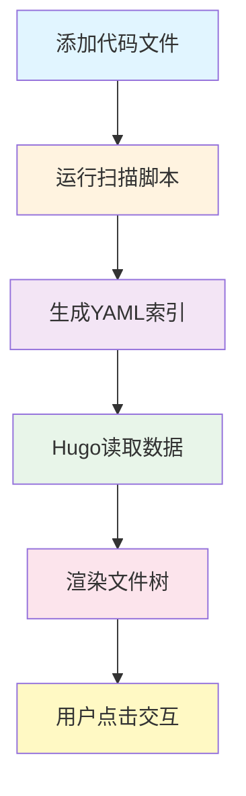

`autotree` 是一个自动化的文件树展示工具，通过 Python 脚本自动扫描代码目录，生成交互式文件树，支持点击查看文件内容（带语法高亮）。告别手动维护，一行代码搞定！

<!-- more -->

## 为什么使用 Autotree？

在技术博客中展示代码文件时，传统方式需要：
- ❌ 手动列出所有文件
- ❌ 手动指定语言类型
- ❌ 手绘 ASCII 树形结构
- ❌ 添加新文件需要重复上述步骤

使用 `autotree` 后：
- ✅ **一行代码**：``
- ✅ **自动扫描**：发现目录下的所有文件
- ✅ **自动树形图**：生成标准 ASCII 树结构
- ✅ **自动识别**：智能推断 20+ 种编程语言
- ✅ **交互式**：点击展开/收起，完整语法高亮
``



## 快速开始（5分钟）

### 1. 安装依赖

```bash
pip3 install pyyaml
```

### 2. 添加代码文件

将代码文件放到 `assets/code/` 目录：

```bash
mkdir -p assets/code/my-scripts
echo '#!/bin/bash\necho "Hello World"' > assets/code/my-scripts/hello.sh
```

### 3. 生成索引

```bash
python3 scripts/generate_filetree.py
```

输出：
```
============================================================
文件树生成器
============================================================
扫描目录: /path/to/hugo-blog/assets/code
输出目录: /path/to/hugo-blog/data/filetrees
------------------------------------------------------------
处理目录: my-scripts
  ✓ 生成: .../data/filetrees/my-scripts.yaml (1 个文件)
------------------------------------------------------------
✓ 完成!
============================================================
```

### 4. 在文章中使用

```markdown
## 我的脚本


```

### 5. 查看效果

```bash
hugo server
```

访问 http://localhost:1313/ 查看效果！页面会显示树形结构，点击文件名即可展开查看内容。

## 实际演示

### 示例 1: Shell 脚本目录

展示 `scripts` 目录下的所有 Shell 脚本：



### 示例 2: Go 语言代码

展示 Go 语言测试代码：



### 示例 3: Python 脚本

展示 Python 脚本：



## 核心特性

### 🚀 零手动维护

添加、删除文件后，只需重新运行脚本：

```bash
python3 scripts/generate_filetree.py
```

所有变更自动同步，无需手动更新文章。

### 🎨 自动树形结构

自动生成标准 ASCII 树形图：

```
scripts/
├── fs_opt.sh
├── init_mount.sh
├── ping.sh
└── temp/
    └── aaa.txt
```

支持嵌套目录，层级清晰。

### 🔍 智能语言识别

根据文件扩展名自动识别语言类型，支持 20+ 种编程语言：

| 扩展名 | 语言 | 扩展名 | 语言 |
|--------|------|--------|------|
| `.sh` | Bash | `.py` | Python |
| `.js` | JavaScript | `.go` | Go |
| `.java` | Java | `.rs` | Rust |
| `.c`, `.h` | C | `.cpp`, `.hpp` | C++ |
| `.json` | JSON | `.yaml`, `.yml` | YAML |
| `.toml` | TOML | `.md` | Markdown |
| `.html` | HTML | `.css` | CSS |
| `.sql` | SQL | `.xml` | XML |

完整列表见 `scripts/generate_filetree.py` 中的 `LANG_MAP`。

### 💡 完整语法高亮

使用 Hugo 内置的 `highlight` 函数，支持：
- 关键字高亮
- 行号显示
- 代码复制按钮
- 主题自适应（亮色/暗色）

### 📱 响应式设计

完美支持桌面端和移动端：
- 自适应布局
- 触摸友好的交互
- 键盘无障碍支持（Enter/Space 展开）

## 工作流程



### 详细步骤

1. **用户操作**：将代码文件添加到 `assets/code/your-dir/`
2. **扫描脚本**：运行 `python3 scripts/generate_filetree.py`
   - 递归扫描目录
   - 生成树形结构
   - 识别文件类型
3. **生成索引**：输出 YAML 文件到 `data/filetrees/your-dir.yaml`
4. **Hugo 构建**：
   - `autotree.html` 读取 YAML 数据
   - 渲染树形结构
   - 使用 `readFile` 读取文件内容
   - 使用 `highlight` 进行语法高亮
5. **用户体验**：
   - 查看树形结构
   - 点击文件名展开内容
   - 享受语法高亮和主题适配

## 文件结构

```
hugo-blog/
├── scripts/
│   └── generate_filetree.py    # 扫描脚本
├── data/
│   └── filetrees/               # 生成的 YAML 索引
│       ├── scripts.yaml
│       ├── golang.yaml
│       └── python.yaml
├── layouts/
│   └── shortcodes/
│       └── autotree.html        # Shortcode 模板
├── assets/
│   ├── code/                    # 代码文件存放位置 ⭐
│   │   ├── scripts/
│   │   ├── golang/
│   │   └── python/
│   └── sass/
│       └── _custom.sass         # 样式定义
└── content/
    └── post/
        └── hugo/
            └── autotree-demo.md # 本文
```

**重要**：所有代码文件必须放在 `assets/code/` 目录下。

## 如何添加新目录

### 方法 1: 命令行

```bash
# 1. 创建目录并添加文件
mkdir -p assets/code/nodejs
cat > assets/code/nodejs/server.js << 'EOF'
const http = require('http');
http.createServer((req, res) => {
  res.end('Hello World!');
}).listen(3000);
EOF

# 2. 生成索引
python3 scripts/generate_filetree.py

# 3. 在文章中使用
# 
```

### 方法 2: 图形界面

1. 在 `assets/code/` 下创建新目录（如 `java-examples`）
2. 添加代码文件到该目录
3. 终端运行：`python3 scripts/generate_filetree.py`
4. 文章中使用：``

### 更新现有目录

修改或添加文件后，只需重新运行脚本：

```bash
python3 scripts/generate_filetree.py
```

Hugo 会自动检测变化并重新构建（如果开启了 `hugo server`）。

## 部署集成

### 自动部署

`deploy.sh` 已集成自动生成步骤：

```bash
./deploy.sh
```

部署流程：
1. Git 更新代码
2. **生成文件树索引** ← 自动运行
3. Hugo 构建站点（含 minify）
4. Nginx 重载配置
5. 推送到 Gitea

### 本地开发

开发时建议开启 Hugo 服务器的文件监听：

```bash
# 1. 生成索引
python3 scripts/generate_filetree.py

# 2. 启动服务器（自动重新构建）
hugo server --buildDrafts --disableFastRender
```

修改代码文件后，只需重新运行步骤 1，Hugo 会自动更新页面。

## 故障排除

### ❌ 找不到目录数据

**错误信息**：
```
⚠️ 错误: 找不到目录 xxx 的数据
```

**解决方案**：
1. 确认目录存在：`ls assets/code/xxx`
2. 运行扫描脚本：`python3 scripts/generate_filetree.py`
3. 验证生成的文件：`cat data/filetrees/xxx.yaml`

### ❌ 文件未找到

**错误信息**：
```
⚠️ 文件未找到: code/scripts/xxx.sh
```

**解决方案**：
1. 检查文件路径：`ls assets/code/scripts/xxx.sh`
2. 重新生成索引：`python3 scripts/generate_filetree.py`
3. 清理缓存重建：`hugo --cleanDestinationDir`

### ❌ ModuleNotFoundError: yaml

**错误信息**：
```
ModuleNotFoundError: No module named 'yaml'
```

**解决方案**：
```bash
pip3 install pyyaml
```

### ❌ 文章未显示

**问题**：新创建的文章在网站上看不到

**解决方案**：
1. 检查 `date` 字段（不能是未来时间）
2. 确认 `draft: false`
3. 使用 `hugo server -D` 查看草稿

### ❌ 样式异常

**问题**：文件树样式显示不正常

**解决方案**：
1. 清理浏览器缓存
2. 确认 `assets/sass/_custom.sass` 存在
3. 检查主题是否正确加载：`hugo --logLevel info`

## 高级技巧

### 自定义树形结构显示

编辑生成的 YAML 文件，自定义树形结构的显示名称：

```yaml
# data/filetrees/scripts.yaml
name: scripts
tree: |
  我的脚本工具集/
  ├── 🔧 系统优化.sh
  ├── 🌐 网络诊断.sh
  └── 📁 临时文件/
      └── 📝 说明.txt
files:
  - path: code/scripts/fs_opt.sh
    name: fs_opt.sh
    lang: bash
```

**注意**：重新运行脚本会覆盖修改，建议在脚本中实现自定义逻辑。

### 排除特定文件

修改 `scripts/generate_filetree.py`，添加过滤规则：

```python
# 在文件开头添加排除模式
EXCLUDE_PATTERNS = [
    '.DS_Store',
    '__pycache__',
    '*.pyc',
    '*.log',
    'node_modules',
    '.git'
]

# 在 build_tree_structure 函数中添加过滤
def should_exclude(path):
    for pattern in EXCLUDE_PATTERNS:
        if fnmatch.fnmatch(path.name, pattern):
            return True
    return False

# 使用过滤
items = [item for item in items if not should_exclude(item)]
```

### 条件显示

在文章中根据条件显示不同的文件树：

```markdown

  

  

```

## 技术细节

### 生成的 YAML 格式

```yaml
name: scripts              # 目录名
tree: |                    # ASCII 树形结构
  scripts/
  ├── fs_opt.sh
  └── ping.sh
files:                     # 文件列表
  - path: code/scripts/fs_opt.sh    # 相对于 assets/ 的路径
    name: fs_opt.sh                  # 显示名称
    lang: bash                       # 语言类型
```

### Shortcode 实现原理

1. **读取数据**：`{{ $data := index .Site.Data.filetrees $dir }}`
2. **渲染树形图**：`<pre>{{ $data.tree }}</pre>`
3. **遍历文件**：`{{ range $data.files }}`
4. **读取内容**：`{{ $content := readFile $filePath }}`
5. **语法高亮**：`{{ highlight $content $lang "" }}`
6. **添加交互**：JavaScript 实现展开/收起

### 样式定义

所有样式在 `assets/sass/_custom.sass` 中：

```sass
.filetree-container        // 主容器
.filetree-header          // 树形结构头部
.filetree-toggle          // 文件切换按钮
.filetree-content         // 文件内容区域
.filetree-code-wrapper    // 代码包装器
```

支持亮色/暗色主题自动切换。

## 性能考虑

### 构建性能

- **扫描速度**：~100ms（小型项目）
- **构建时间**：与 Hugo 标准构建一致
- **增量构建**：仅更新修改的文件（Hugo 自动处理）

### 页面性能

- **文件大小**：每个文件树 ~10-50KB（取决于代码量）
- **加载策略**：内容默认隐藏，点击时展开
- **优化建议**：单个目录建议不超过 50 个文件

### 最佳实践

1. **合理分组**：按功能或语言分类目录
2. **控制大小**：大文件（>1MB）考虑使用链接
3. **定期清理**：删除不需要的示例代码
4. **版本管理**：将生成的 YAML 文件纳入 Git

## 常见问题（FAQ）

**Q: 支持哪些文件类型？**
A: 支持所有文本文件，包括 20+ 种编程语言。二进制文件不支持。

**Q: 可以展示 private 仓库的代码吗？**
A: 可以，代码文件在本地，不涉及网络请求。

**Q: 如何更新文件列表？**
A: 修改代码后运行 `python3 scripts/generate_filetree.py` 即可。

**Q: 是否支持代码搜索？**
A: 目前不支持，可以使用浏览器的页面内搜索（Ctrl+F / Cmd+F）。

**Q: 可以下载文件吗？**
A: 暂不支持，可通过 GitHub 链接提供下载。

**Q: 性能如何？**
A: 扫描和构建速度快，页面加载按需展开，性能优秀。

## 总结

`autotree` shortcode 通过自动化扫描和智能渲染，将复杂的文件展示流程简化为一行代码。无论是展示项目结构、教程代码还是配置文件，都能快速、美观、交互式地呈现给读者。

**核心优势回顾**：
- 🎯 **一行代码**：``
- 🚀 **零维护**：自动扫描和更新
- 🎨 **美观**：树形结构 + 语法高亮
- 📱 **响应式**：完美支持移动端
- ♿ **无障碍**：键盘操作支持

