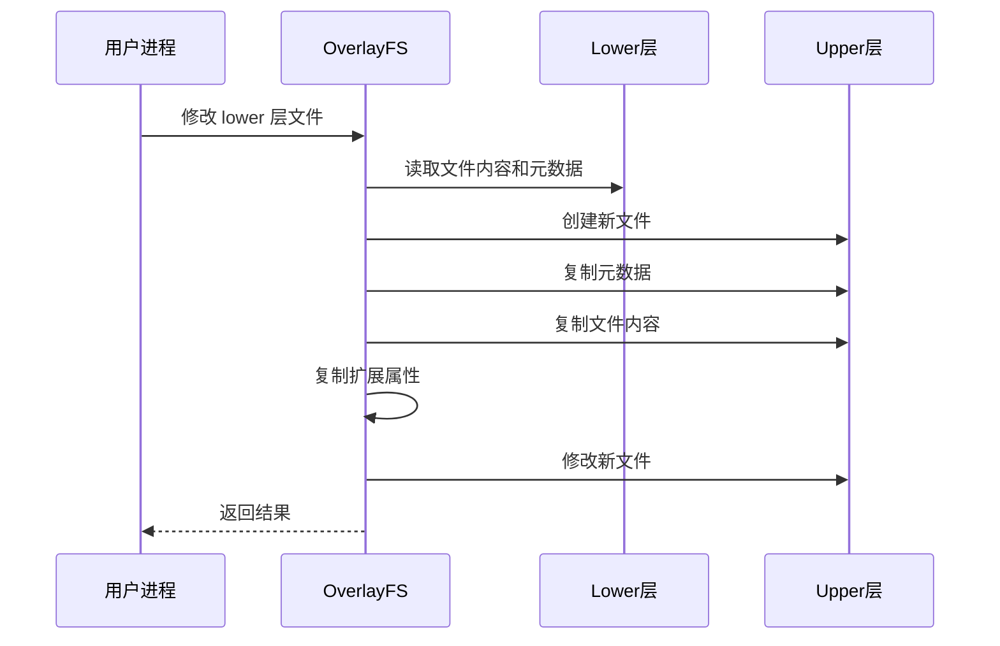

**OverlayFS 是 Linux 内核中的联合文件系统实现，通过叠加多个目录层形成统一的文件系统视图。** 本文将深入介绍 OverlayFS 的工作原理、核心概念、高级特性以及在 Docker 等容器技术中的实际应用。

<!-- more -->

## 什么是 OverlayFS

OverlayFS（有时称为 union-filesystem）是一种"混合"型的联合文件系统。它允许将多个目录（称为"层"）叠加在一起，形成一个统一的文件系统视图。与传统的完全独立的文件系统不同，OverlayFS 中的对象可能直接来自底层文件系统，这种设计使其成为容器技术（如 Docker、Podman）的核心基础设施之一。

### 核心优势

| 特性 | 说明 |
|-----|------|
| **存储高效** | 多个容器共享相同的只读基础层 |
| **快速启动** | 无需复制整个文件系统 |
| **按需复制** | 只有修改的文件才会被复制到上层 |
| **灵活组合** | 易于组合和复用镜像层 |

## 架构原理

### 层级结构

OverlayFS 通过组合多个目录层来工作，主要包括：

- **upper 层**：可写层，存储所有修改
- **lower 层**：一个或多个只读的基础层
- **workdir**：工作目录，用于内部操作（必须在同一文件系统上）

```bash
# 基本挂载语法
mount -t overlay overlay \
  -o lowerdir=/lower1:/lower2,upperdir=/upper,workdir=/work \
  /merged
```

### 目录合并示意图


### 文件查找规则

当访问文件时，OverlayFS 按以下顺序查找：

1. 首先在 upper 层查找
2. 如果未找到，按顺序在各个 lower 层查找（从右向左）
3. 返回第一个找到的文件

## 核心概念

### Copy-on-Write 机制

写入操作的行为取决于文件的位置：

| 操作类型 | 文件在 lower 层 | 文件在 upper 层 |
|---------|----------------|----------------|
| 读取 | 直接读取 | 直接读取 |
| 写入 | **复制后修改** (Copy-up) | 直接写入 |
| 删除 | 在 upper 层创建白文件 | 删除文件 |
| 重命名 | 复制后删除源 | 直接重命名 |

Copy-up 过程确保了 lower 层的只读特性：



### Whiteouts 和 Opaque 目录

为了支持在不修改 lower 文件系统的情况下执行 `rm` 和 `rmdir`，OverlayFS 使用白文件（whiteouts）和不透明目录（opaque directories）。

**白文件**是以下两种形式之一：
- 设备号为 0/0 的字符设备
- 带有 `trusted.overlay.whiteout` xattr 的零大小常规文件

当在 merged 目录的 upper 层发现白文件时，lower 层中任何匹配的名称都会被忽略，白文件本身也被隐藏。

**不透明目录**通过设置 `trusted.overlay.opaque` xattr 为 `"y"` 来标记。当 upper 文件系统包含不透明目录时，lower 文件系统中任何同名目录都会被忽略。

## 高级特性

### 多个 Lower 层

OverlayFS 支持多个 lower 层，使用冒号（`:`）分隔：

```bash
mount -t overlay overlay \
  -o lowerdir=/lower1:/lower2:/lower3 \
  /merged
```

查找顺序为：`upper → lower1 → lower2 → lower3`


目录名包含冒号时，需要用反斜杠转义：
```bash
mount -t overlay overlay -olowerdir=/a\:lower\:\:dir /merged
```


### Metacopy（仅元数据复制）

启用 metacopy 功能后，OverlayFS 在执行 chown/chmod 等元数据操作时，只复制元数据而不是整个文件。

**工作原理：**
1. upper 文件用 `trusted.overlayfs.metacopy` xattr 标记
2. 该 xattr 表示 upper 文件不包含数据
3. 数据在文件以 WRITE 方式打开时才被复制
4. 数据复制后，metacopy xattr 被移除

```bash
# 启用 metacopy
mount -t overlay overlay \
  -o lowerdir=/lower,upperdir=/upper,workdir=/work,metacopy=on \
  /merged
```


不要对不受信任的 upper/lower 目录使用 `metacopy=on`。攻击者可能通过构造特定的文件绕过安全限制。


### Data-only Lower 层

在启用 metacopy 时，OverlayFS 常规文件可以由三层信息组成：

1. 来自 upper 层文件的元数据
2. 来自某个 lower 层文件的 st_ino 和 st_dev
3. 来自另一个 lower 层（更下方）的数据

使用双冒号（`::`）分隔符定义 data-only lower 层：

```bash
mount -t overlay overlay \
  -o lowerdir=/l1:/l2:/l3::/do1::/do2 \
  /merged
```

### Redirect_dir 功能

当重命名 lower 层或 merged 目录时，OverlayFS 有两种处理方式：

1. **默认行为**：返回 `EXDEV` 错误
2. **启用 redirect_dir**：目录被复制（不含内容），设置 `trusted.overlay.redirect` 扩展属性，然后移动目录

```bash
# 启用 redirect_dir
mount -t overlay overlay \
  -o lowerdir=/lower,upperdir=/upper,workdir=/work,redirect_dir=on \
  /merged
```

| 选项 | 说明 |
|-----|------|
| `redirect_dir=on` | 启用重定向 |
| `redirect_dir=follow` | 不创建重定向，但跟随已有的 |
| `redirect_dir=nofollow` | 不创建也不跟随重定向 |
| `redirect_dir=off` | 默认行为，返回 EXDEV |

### Xino 功能

Xino 功能用于保证 `st_ino` 和 `st_dev` 的唯一性，使其行为更符合标准文件系统。

```bash
# 启用 xino
mount -t overlay overlay \
  -o lowerdir=/lower,upperdir=/upper,workdir=/work,xino=auto \
  /merged
```

**不同配置下的 Inode 属性：**

| 配置 | 持久 st_ino | 统一 st_dev | st_ino == d_ino |
|-----|------------|------------|---------------|
| 所有层在同一 fs | ✓ | ✓ | ✓ |
| 层不在同一 fs, xino=off | ✗ | ✗ | ✓ |
| xino=on/auto | ✓ | ✓ | ✓ |
| xino=on/auto, ino 溢出 | ✗ | ✗ | ✓ |

## 权限模型

OverlayFS 使用缓存凭证来访问 lower 或 upper 文件系统。权限检查遵循以下原则：

1. 复制前后权限检查应返回相同结果
2. 创建 overlay 挂载的任务不应获得额外权限
3. 任务可能通过 overlay 获得比直接访问底层文件系统更多的权限

每次访问执行两次权限检查：

1. 检查当前任务是否允许访问（基于 DAC 和 MAC）
2. 检查缓存凭证是否允许对 lower/upper 层进行实际操作

这可以通过以下命令类比理解：

```bash
# OverlayFS 挂载相当于：
cp -a /lower /upper
mount --bind /upper /merged
```

区别在于复制时机：OverlayFS 是按需复制，而 `cp -a` 是提前复制。

## 使用 OverlayFS

### 基本命令行用法

```bash
# 创建目录结构
mkdir -p /mnt/overlay/{lower,upper,work,merged}

# 在 lower 层创建一些文件
echo "Hello from lower" > /mnt/overlay/lower/file1.txt
mkdir -p /mnt/overlay/lower/subdir
echo "Subdir content" > /mnt/overlay/lower/subdir/file2.txt

# 挂载 OverlayFS
mount -t overlay overlay \
  -o lowerdir=/mnt/overlay/lower,upperdir=/mnt/overlay/upper,workdir=/mnt/overlay/work \
  /mnt/overlay/merged

# 访问合并后的文件系统
ls /mnt/overlay/merged/
# 输出: file1.txt  subdir

# 修改文件（会触发 Copy-up）
echo "Modified content" > /mnt/overlay/merged/file1.txt

# 删除文件（会在 upper 层创建白文件）
rm /mnt/overlay/merged/file1.txt

# 查看文件系统结构
tree /mnt/overlay/
# upper/
# └── file1.txt  (白文件，设备号为 0/0)
# lower/
# ├── file1.txt
# └── subdir/
#     └── file2.txt
# merged/
# └── subdir/
#     └── file2.txt

# 卸载
umount /mnt/overlay/merged
```

### 生产环境推荐配置

```bash
# 推荐的生产环境挂载选项
mount -t overlay overlay \
  -o lowerdir=/lower1:/lower2,upperdir=/upper,workdir=/work,metacopy=on,index=on \
  /merged
```

各选项说明：

| 选项 | 用途 |
|-----|------|
| `metacopy=on` | 仅元数据复制，减少不必要的文件复制 |
| `index=on` | 确保硬链接复制后保持关联 |
| `redirect_dir=on` | 支持跨层重命名目录 |
| `userxattr` | 使用 `user.overlay.` 命名空间，支持非特权挂载 |

## 在 Docker 中的应用

Docker 是 OverlayFS 最著名的应用场景之一。每个 Docker 镜像由多个只读层组成：

```bash
# Docker 镜像层结构
/var/lib/docker/overlay2/
├── <镜像层ID>/
│   └── diff/          # 只读层内容
├── <容器ID>/
│   ├── diff/          # 容器的可写层
│   ├── work/          # 工作目录
│   └── merged/        # 合并视图（容器文件系统根目录）
```

**Docker 的优势：**

1. **存储效率**：多个镜像共享相同的只读层
2. **快速启动**：无需复制基础镜像
3. **版本管理**：每层都有唯一的标识
4. **易于分发**：只需分发差异层

## NFS 导出支持

当底层文件系统支持 NFS 导出并启用 `nfs_export` 功能时，OverlayFS 可以导出到 NFS。

```bash
mount -t overlay overlay \
  -o lowerdir=/lower,upperdir=/upper,workdir=/work,nfs_export=on,index=on \
  /merged
```

**NFS 文件句柄编码规则：**

1. 对于非 upper 对象，从 lower inode 编码 lower 文件句柄
2. 对于索引对象，从 copy_up origin 编码 lower 文件句柄
3. 对于 pure-upper 对象和现有非索引 upper 对象，从 upper inode 编码 upper 文件句柄


`index=off,nfs_export=on` 对于读写挂载是冲突的，会报错。


## 性能特性与限制

### 性能优势

| 场景 | 说明 |
|-----|------|
| 只读访问 | 与直接访问底层文件系统性能相当 |
| 容器启动 | 无需复制基础镜像，启动极快 |
| 多实例共享 | 多个容器共享同一基础镜像，节省磁盘空间 |

### 性能劣势与限制

| 限制 | 说明 |
|-----|------|
| 大量小文件 | 元数据操作开销较大 |
| 频繁写入 | CoW 机制增加写入开销 |
| 文件重命名 | 跨层重命名需要复制整个文件 |
| 嵌套限制 | 不能同时作为多个 OverlayFS 的 lower 层 |

### 非 POSIX 标准行为

1. **读取时更新 atime**：lower 层文件的 atime 不会更新
2. **内存映射**：lower 层文件只读打开后以 MAP_SHARED 映射，后续修改不会反映到映射中
3. **执行文件写入**：正在执行的 lower 层文件可以被打开写入或截断（不会返回 ETXTBSY）

## 故障排查

### 常见错误

```bash
# 错误：workdir 和 upperdir 必须在同一文件系统
mount: /overlay: wrong fs type, bad option, bad superblock

# 解决：确保 upperdir 和 workdir 在同一分区
mount -t overlay overlay \
  -o lowerdir=/lower,upperdir=/overlay/upper,workdir=/overlay/work \
  /merged
```

```bash
# 错误：文件系统已满
No space left on device

# 解决：检查 upper 层空间使用情况
df -h /overlay/upper
du -sh /overlay/work
```

```bash
# 错误：重命名跨层目录失败
mv: cannot move 'dir' across device boundaries

# 解决：启用 redirect_dir
mount -t overlay overlay \
  -o lowerdir=/lower,upperdir=/upper,workdir=/work,redirect_dir=on \
  /merged
```

### 调试技巧

```bash
# 查看挂载详细信息
mount | grep overlay

# 检查 OverlayFS 特定属性
getfattr -d -m "trusted.overlay.*" /overlay/merged/some-file

# 查看内核日志
dmesg | grep overlay

# 检查 xino 状态
cat /sys/module/overlay/parameters/xino_auto

# 查看 redirect_dir 状态
cat /sys/module/overlay/parameters/redirect_dir
```

## 高级挂载选项

### Userxattr

`userxattr` 选项强制 OverlayFS 使用 `user.overlay.` xattr 命名空间而不是 `trusted.overlay.`，这对于非特权挂载 OverlayFS 很有用：

```bash
mount -t overlay overlay \
  -o lowerdir=/lower,upperdir=/upper,workdir=/work,userxattr \
  /merged
```

### Volatile 挂载

启用 volatile 选项后，挂载不保证在崩溃后存活：

```bash
mount -t overlay overlay \
  -o lowerdir=/lower,upperdir=/upper,workdir=/work,volatile \
  /merged
```

优势是省略所有对 upper 文件系统的 sync 调用。如果 upperdir 文件系统在 volatile 挂载后发生任何写回错误，所有 sync 函数都会返回错误。

### UUID 和 fsid 控制

| 选项 | 说明 |
|-----|------|
| `uuid=null` | OverlayFS UUID 为 null，fsid 取自最上层文件系统 |
| `uuid=off` | UUID 为 null，忽略底层层 UUID |
| `uuid=on` | 生成并使用唯一 fsid，UUID 存储在 xattr 中 |
| `uuid=auto` (默认) | 从 xattr 读取 UUID，新挂载升级到 on |

## 总结

OverlayFS 是一个强大而高效的联合文件系统，特别适合容器化场景。其核心优势包括：

- **高效的存储利用**：通过层共享减少磁盘占用
- **快速的启动时间**：无需复制基础镜像
- **灵活的层管理**：易于组合和复用镜像层
- **丰富的特性集**：支持 metacopy、data-only 层、NFS 导出等高级功能

然而，在使用时也需要注意其限制，特别是在大量小文件和频繁写入的场景下。合理规划层结构、监控资源使用、选择合适的挂载选项，是充分发挥 OverlayFS 优势的关键。

**最佳实践：**

1. 根据访问频率合理排序 lower 层
2. 监控 workdir 大小，确保有足够空间
3. 在生产环境启用 metacopy 和 index
4. 不要对不受信任的层使用 metacopy
5. 了解并配置 redirect_dir 以满足跨层重命名需求

对于现代容器化应用和 CI/CD 流水线，OverlayFS 已经成为一个不可或缺的基础设施组件。

## 参考资源

- [Linux Kernel OverlayFS Documentation](https://docs.kernel.org/filesystems/overlayfs.html)
- [Docker Storage Drivers Documentation](https://docs.docker.com/storage/storagedriver/overlayfs-driver/)
- [OverlayFS in Containers: Deep Dive](https://www.redhat.com/en/blog/overlayfs-and-containers-deep-dive)
- [Unionmount Testsuite](https://github.com/amir73il/unionmount-testsuite.git)
