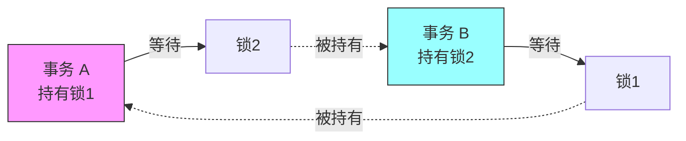

在多用户并发访问数据库时，如何保证数据的一致性和完整性？这就需要锁机制来协调不同事务之间的操作。**MySQL 锁机制**是数据库并发控制的核心，理解锁的工作原理对于设计高性能、高并发的数据库应用至关重要。本文将系统性地介绍 MySQL 中的各种锁类型、加锁机制、死锁问题以及实战优化技巧。

<!-- more -->

## 简介

### 什么是锁

**锁（Lock）**是数据库用来管理并发访问共享资源的一种机制。当多个事务同时访问同一份数据时，锁可以确保数据的一致性，防止出现脏读、不可重复读、幻读等并发问题。

在 MySQL 中，锁就像是一把保护数据的"门锁"：
- **独占锁（排他锁）**：就像卧室的门，一次只能一个人进入
- **共享锁（读锁）**：就像图书馆的书，可以多人同时阅读，但不能同时修改

### 为什么需要锁

| 场景 | 问题 | 锁的作用 |
|------|------|----------|
| **并发读写** | 多个事务同时读写同一数据 | 协调访问顺序，保证数据一致性 |
| **数据完整性** | 更新操作被其他事务中断 | 保证操作的原子性 |
| **隔离性保障** | 事务之间互相干扰 | 实现不同的隔离级别 |
| **防止丢失更新** | 两个事务同时更新导致覆盖 | 确保更新操作串行化 |

### MySQL 锁的分类

MySQL 的锁可以从不同维度进行分类：

**按锁的粒度分类：**

```
全局锁（Global Lock）
├── 整个数据库实例级别的锁
│
表级锁（Table Lock）
├── MyISAM 的表锁
├── 元数据锁（MDL）
└── 意向锁（Intention Lock）
│
行级锁（Row Lock）
├── 记录锁（Record Lock）
├── 间隙锁（Gap Lock）
├── 临键锁（Next-Key Lock）
└── 插入意向锁（Insert Intention Lock）
```

**按锁的属性分类：**
- **共享锁（S Lock）**：也叫读锁，多个事务可以同时持有
- **排他锁（X Lock）**：也叫写锁，只能有一个事务持有

**按锁的状态分类：**
- **乐观锁**：基于版本号或时间戳，不真正加锁
- **悲观锁**：每次操作都加锁

## 全局锁

### 什么是全局锁

全局锁是对整个数据库实例加锁，加锁后整个数据库实例处于只读状态。

### 使用场景

全局锁主要用于**全库逻辑备份**，确保备份过程中数据的一致性。

### 加锁语法


-- 加全局读锁
FLUSH TABLES WITH READ LOCK;

-- 执行备份操作
mysqldump -h127.0.0.1 -uroot -p123456 dbname > backup.sql

-- 释放全局锁
UNLOCK TABLES;


### 全局锁的影响

加了全局锁之后：
- ✅ 可以执行 SELECT 查询
- ❌ 不能执行 INSERT、UPDATE、DELETE
- ❌ 不能执行 DDL 语句（CREATE、ALTER、DROP）
- ❌ 已经开启的事务中的更新操作会被阻塞

### 更好的备份方案

由于全局锁会让整个数据库不可写，对业务影响较大。更推荐的方案是：

**InnoDB 引擎：使用 mysqldump 的 --single-transaction 参数**

```bash
# 使用一致性快照，不会锁表
mysqldump --single-transaction -h127.0.0.1 -uroot -p dbname > backup.sql
```

这种方式利用 InnoDB 的 MVCC 机制，在备份过程中不会阻塞其他事务的读写操作。

## 表级锁

### 表锁（Table Lock）

表锁是 MySQL 中最基本的锁策略，开销最小但并发度最低。

#### 加锁语法


-- 加读锁
LOCK TABLES table_name READ;

-- 加写锁
LOCK TABLES table_name WRITE;

-- 释放锁
UNLOCK TABLES;


#### 表锁的特点

| 锁类型 | 当前会话 | 其他会话 |
|--------|----------|----------|
| **读锁** | 可以读本表，不能读其他表<br/>不能更新本表 | 可以读本表<br/>更新操作会等待 |
| **写锁** | 可以读写本表<br/>不能访问其他表 | 读写操作都会等待 |

#### 示例

```sql
-- 会话 A
LOCK TABLES order_table READ;
SELECT * FROM order_table;  -- ✅ 可以执行
UPDATE order_table SET status=1;  -- ❌ 报错：表被锁定

-- 会话 B（同时进行）
SELECT * FROM order_table;  -- ✅ 可以执行
UPDATE order_table SET status=1;  -- ⏰ 等待会话 A 释放锁
```

### 元数据锁（MDL）

元数据锁是 MySQL 5.5 引入的，用于保护表结构的锁，**不需要显式使用，系统自动管理**。

#### MDL 的加锁规则

| 操作类型 | 加锁类型 | 说明 |
|----------|----------|------|
| SELECT | MDL 读锁 | 允许并发读，阻塞写 |
| INSERT/UPDATE/DELETE | MDL 读锁 | 允许并发读，阻塞写 |
| ALTER TABLE | MDL 写锁 | 阻塞所有读写操作 |

#### MDL 死锁案例

```mermaid
sequenceDiagram
    participant T1 as 事务1
    participant T2 as 事务2
    participant T3 as 事务3
    participant Database

    T1->>+Database: BEGIN
    T1->>Database: SELECT * FROM t (获取 MDL 读锁)
    Note over T1: 事务未提交<br/>持有 MDL 读锁

    T2->>Database: ALTER TABLE t... (尝试获取 MDL 写锁)
    Note over T2: 等待 T1 释放 MDL 读锁

    T3->>Database: SELECT * FROM t (尝试获取 MDL 读锁)
    Note over T3: 被 T2 阻塞<br/>排队等待

    T1->>-Database: COMMIT (释放 MDL 读锁)
    Note over T2: 获取到 MDL 写锁
```

{}
长事务会持有 MDL 锁很久，在执行 DDL 语句之前，务必确认没有长时间运行的事务。可以使用 `SHOW PROCESSLIST` 查看当前运行的事务。
{}

### 意向锁（Intention Lock）

意向锁是 InnoDB 引擎自动加的**表级锁**，用于协调行锁和表锁的关系。

#### 意向锁的类型

- **意向共享锁（IS）**：事务打算给某些行加共享锁时，先在表上加 IS 锁
- **意向排他锁（IX）**：事务打算给某些行加排他锁时，先在表上加 IX 锁

#### 意向锁的兼容性

|  | IS | IX | S | X |
|--|----|----|---|---|
| **IS** | ✅ | ✅ | ✅ | ❌ |
| **IX** | ✅ | ✅ | ❌ | ❌ |
| **S** | ✅ | ❌ | ✅ | ❌ |
| **X** | ❌ | ❌ | ❌ | ❌ |

#### 意向锁的作用

假设没有意向锁，当要对表加表级写锁时：

```sql
LOCK TABLES t WRITE;
```

MySQL 需要遍历表中的每一行，检查是否有行级锁，效率很低。

有了意向锁，只需要检查表级的意向锁，判断是否冲突即可，大大提高了效率。

## 行级锁

行级锁是 InnoDB 存储引擎的核心特性，相比表锁具有更好的并发性能。

### 行锁的基本类型

#### 共享锁（S Lock）

也叫**读锁**，多个事务可以同时对同一行数据加共享锁。


-- 显式加共享锁
SELECT * FROM table_name WHERE id = 1 LOCK IN SHARE MODE;

-- MySQL 8.0 推荐新语法
SELECT * FROM table_name WHERE id = 1 FOR SHARE;


#### 排他锁（X Lock）

也叫**写锁**，一次只能有一个事务对某行数据加排他锁。


-- 显式加排他锁
SELECT * FROM table_name WHERE id = 1 FOR UPDATE;

-- DML 语句自动加排他锁
UPDATE table_name SET status = 1 WHERE id = 1;
DELETE FROM table_name WHERE id = 1;


#### 锁的兼容性

|  | S | X |
|--|---|---|
| **S** | ✅ 兼容 | ❌ 冲突 |
| **X** | ❌ 冲突 | ❌ 冲突 |

### 行锁的具体实现

InnoDB 的行锁是通过给**索引项加锁**来实现的，这一点非常重要。

#### 记录锁（Record Lock）

记录锁是对**索引记录**加锁，锁定的是索引而不是数据行本身。

```sql
-- 假设 id 是主键
SELECT * FROM user WHERE id = 10 FOR UPDATE;
```

这条语句会在 id=10 的索引记录上加排他锁。

#### 间隙锁（Gap Lock）

间隙锁锁定的是索引记录之间的间隙，防止其他事务在这个间隙中插入数据。

**间隙锁只在可重复读（REPEATABLE READ）隔离级别下生效。**

```sql
-- 假设表中有 id = 5, 10, 15 三条记录
-- 事务 A
BEGIN;
SELECT * FROM user WHERE id > 5 AND id < 15 FOR UPDATE;
```

这条语句会锁定的间隙：
- (5, 10) 之间的间隙
- (10, 15) 之间的间隙

其他事务尝试在这些间隙插入数据会被阻塞：

```sql
-- 事务 B
INSERT INTO user (id, name) VALUES (8, 'Tom');  -- ⏰ 等待
```

#### 临键锁（Next-Key Lock）

临键锁 = 记录锁 + 间隙锁，锁定一个范围，并且锁定记录本身。

**InnoDB 的行锁默认使用 Next-Key Lock。**

```sql
-- 假设表中有 id = 5, 10, 15 三条记录
SELECT * FROM user WHERE id >= 10 FOR UPDATE;
```

锁定范围：
- (5, 10] 临键锁
- (10, 15] 临键锁
- (15, +∞) 临键锁

#### 插入意向锁（Insert Intention Lock）

插入意向锁是一种特殊的间隙锁，在 INSERT 操作之前设置。

**插入意向锁之间不冲突**，即使插入到同一个间隙，只要不是同一行数据，多个事务可以并发插入。

### 行锁的加锁规则

InnoDB 的加锁规则比较复杂，取决于：
1. **索引类型**：主键索引、唯一索引、普通索引、无索引
2. **查询条件**：等值查询、范围查询
3. **隔离级别**：主要是 REPEATABLE READ 和 READ COMMITTED

#### 唯一索引等值查询

**场景1：记录存在**


-- id 是主键或唯一索引，且 id=10 存在
SELECT * FROM user WHERE id = 10 FOR UPDATE;


加锁情况：只在 id=10 这条记录上加**记录锁**（Record Lock），不会加间隙锁。

**场景2：记录不存在**

```sql
-- id 是主键或唯一索引，但 id=8 不存在
-- 假设现有数据: id = 5, 10, 15
SELECT * FROM user WHERE id = 8 FOR UPDATE;
```

加锁情况：在 (5, 10) 这个间隙上加**间隙锁**（Gap Lock）。

#### 唯一索引范围查询

```sql
-- id 是主键，现有数据: id = 5, 10, 15, 20
SELECT * FROM user WHERE id >= 10 AND id < 15 FOR UPDATE;
```

加锁情况：
- id=10：记录锁
- (10, 15)：间隙锁
- id=15：记录锁（Next-Key Lock 的特性）

#### 普通索引等值查询

```sql
-- age 是普通索引，现有数据: age = 10, 15, 15, 20
SELECT * FROM user WHERE age = 15 FOR UPDATE;
```

加锁情况：
- age=15 的所有记录：记录锁
- (10, 15)：间隙锁（向左扫描）
- (15, 20)：间隙锁（向右扫描到第一个不满足条件的值）

#### 无索引

{}
如果查询条件没有使用索引，InnoDB 会扫描全表所有记录，并给每一行都加上锁，**等同于表锁**，严重影响并发性能。
{}

```sql
-- name 字段没有索引
SELECT * FROM user WHERE name = 'Tom' FOR UPDATE;
```

这条语句会锁住整张表的所有行！

## 行锁实战案例

### 案例1：库存扣减

电商系统中的库存扣减是典型的并发场景。

**错误做法：**

```java
// 先查询库存
Integer stock = productMapper.getStock(productId);

if (stock > 0) {
    // 再更新库存
    productMapper.updateStock(productId, stock - 1);
}
```

这种方式在高并发下会出现超卖问题，因为查询和更新不是原子操作。

**正确做法1：使用 FOR UPDATE**


-- 查询并加排他锁
SELECT stock FROM product WHERE id = 100 FOR UPDATE;

-- 判断库存后更新
UPDATE product SET stock = stock - 1 WHERE id = 100;

-- 提交事务
COMMIT;


**正确做法2：直接在 SQL 中判断**

```sql
UPDATE product
SET stock = stock - 1
WHERE id = 100 AND stock > 0;
```

检查 `affected rows`，如果为 0 说明库存不足。

### 案例2：分布式锁实现

使用数据库行锁可以实现简单的分布式锁。


-- 创建锁表
CREATE TABLE distributed_lock (
    lock_name VARCHAR(64) PRIMARY KEY,
    holder VARCHAR(64),
    lock_time TIMESTAMP
);

-- 获取锁（插入或更新）
INSERT INTO distributed_lock (lock_name, holder, lock_time)
VALUES ('order_lock', 'server1', NOW())
ON DUPLICATE KEY UPDATE
    holder = IF(lock_time < DATE_SUB(NOW(), INTERVAL 30 SECOND), 'server1', holder),
    lock_time = IF(lock_time < DATE_SUB(NOW(), INTERVAL 30 SECOND), NOW(), lock_time);

-- 释放锁
DELETE FROM distributed_lock WHERE lock_name = 'order_lock' AND holder = 'server1';


### 案例3：避免间隙锁导致的死锁

**场景描述：**

```sql
-- 表结构
CREATE TABLE account (
    id INT PRIMARY KEY,
    balance DECIMAL(10,2)
);

-- 现有数据: id = 10, 20, 30
```

**事务执行时序：**

```sql
-- 时刻1：事务 A
BEGIN;
UPDATE account SET balance = balance - 100 WHERE id = 15;  -- 不存在，加间隙锁 (10, 20)

-- 时刻2：事务 B
BEGIN;
UPDATE account SET balance = balance - 100 WHERE id = 16;  -- 不存在，加间隙锁 (10, 20)，等待 A

-- 时刻3：事务 A
INSERT INTO account VALUES (15, 1000);  -- 尝试插入，等待 B

-- 💀 死锁发生！
```

**解决方案：**

1. **降低隔离级别**：使用 READ COMMITTED 隔离级别，不会有间隙锁
2. **检查记录是否存在**：先 SELECT 判断，存在才 UPDATE
3. **使用主键更新**：确保更新的记录存在

## 死锁

### 什么是死锁

死锁是指两个或多个事务互相等待对方释放锁,导致所有事务都无法继续执行。



### 死锁示例

```sql
-- 事务 A
BEGIN;
UPDATE account SET balance = balance - 100 WHERE id = 1;  -- 锁住 id=1
-- 等待一会儿
UPDATE account SET balance = balance - 100 WHERE id = 2;  -- 尝试锁住 id=2，等待

-- 事务 B（同时进行）
BEGIN;
UPDATE account SET balance = balance - 100 WHERE id = 2;  -- 锁住 id=2
-- 等待一会儿
UPDATE account SET balance = balance - 100 WHERE id = 1;  -- 尝试锁住 id=1，等待

-- 💀 死锁！
```

### 查看死锁信息


-- 查看最近一次死锁信息
SHOW ENGINE INNODB STATUS;

-- 查看当前锁等待情况（MySQL 8.0+）
SELECT * FROM performance_schema.data_locks;
SELECT * FROM performance_schema.data_lock_waits;


### 死锁的预防

1. **按相同顺序访问资源**

```sql
-- ✅ 好的做法：总是按 id 升序更新
UPDATE account SET balance = balance - 100
WHERE id IN (1, 2, 3)
ORDER BY id;
```

2. **缩短事务时间**

```java
// ❌ 不好的做法
begin();
// 执行业务逻辑
thread.sleep(5000);  // 长时间持有锁
update();
commit();

// ✅ 好的做法
// 执行业务逻辑
begin();
update();  // 快速执行
commit();
```

3. **降低隔离级别**

将隔离级别从 REPEATABLE READ 降低到 READ COMMITTED，减少间隙锁的使用。

```sql
SET SESSION TRANSACTION ISOLATION LEVEL READ COMMITTED;
```

4. **使用合理的索引**

确保查询条件能够使用索引，减少锁的范围。

5. **设置锁等待超时**

```sql
-- 设置锁等待超时时间（秒）
SET innodb_lock_wait_timeout = 10;
```

## 乐观锁与悲观锁

### 悲观锁

**悲观锁认为数据在被使用时一定会被修改，所以在操作数据前先加锁。**

MySQL 的行锁（FOR UPDATE）就是悲观锁的实现。


BEGIN;

-- 加排他锁，其他事务无法读写
SELECT * FROM product WHERE id = 100 FOR UPDATE;

-- 业务逻辑处理
UPDATE product SET stock = stock - 1 WHERE id = 100;

COMMIT;


**优点：**
- 数据冲突较多时效率高
- 保证数据强一致性

**缺点：**
- 并发性能低
- 可能产生死锁

### 乐观锁

**乐观锁认为数据在被使用时不会被修改，只在更新时检查是否被其他事务修改过。**

常用**版本号机制**或**时间戳机制**实现。

#### 版本号实现

```sql
-- 1. 添加版本号字段
ALTER TABLE product ADD COLUMN version INT DEFAULT 0;

-- 2. 查询数据（不加锁）
SELECT id, stock, version FROM product WHERE id = 100;
-- 假设查询结果：stock=50, version=10

-- 3. 更新时检查版本号
UPDATE product
SET stock = 49, version = version + 1
WHERE id = 100 AND version = 10;

-- 4. 检查影响行数
-- affected_rows = 1：更新成功
-- affected_rows = 0：版本号已变化，说明被其他事务修改过，更新失败
```

**Java 代码示例：**

```java
public boolean updateStock(int productId, int quantity) {
    // 1. 查询当前数据
    Product product = productMapper.selectById(productId);

    if (product.getStock() < quantity) {
        return false;  // 库存不足
    }

    // 2. 更新时检查版本号
    int affectedRows = productMapper.updateWithVersion(
        productId,
        product.getStock() - quantity,
        product.getVersion()
    );

    // 3. 判断是否更新成功
    if (affectedRows == 0) {
        // 版本号不匹配，需要重试
        return updateStock(productId, quantity);  // 递归重试
    }

    return true;
}
```

**优点：**
- 并发性能高
- 不会产生死锁

**缺点：**
- 数据冲突较多时，大量重试影响性能
- 需要额外的版本号字段

### 选择建议

| 场景 | 推荐方案 |
|------|----------|
| **高并发读，少量写** | 乐观锁 |
| **写操作频繁，冲突多** | 悲观锁 |
| **短事务** | 悲观锁 |
| **长事务** | 乐观锁 |
| **秒杀场景** | 悲观锁 + Redis |

## 锁优化最佳实践

### 1. 尽量使用索引

{}
无索引的查询会导致全表扫描，InnoDB 会锁住整张表，严重影响并发性能。
{}

```sql
-- ❌ 没有索引，会锁全表
UPDATE user SET status = 1 WHERE name = 'Tom';

-- ✅ 在 name 上建立索引
CREATE INDEX idx_name ON user(name);
UPDATE user SET status = 1 WHERE name = 'Tom';
```

### 2. 缩小锁的范围

```sql
-- ❌ 锁的范围太大
BEGIN;
SELECT * FROM order WHERE user_id = 100 FOR UPDATE;  -- 锁住该用户所有订单
-- 业务处理...
COMMIT;

-- ✅ 只锁必要的行
BEGIN;
SELECT * FROM order WHERE id = 12345 FOR UPDATE;  -- 只锁一条订单
-- 业务处理...
COMMIT;
```

### 3. 缩短锁的持有时间

```java
// ❌ 不好的做法
begin();
query();        // 1ms
businessLogic();  // 100ms（调用外部接口、复杂计算等）
update();       // 1ms
commit();
// 锁持有时间：102ms

// ✅ 好的做法
query();
businessLogic();  // 100ms
begin();
update();       // 1ms
commit();
// 锁持有时间：1ms
```

### 4. 避免在循环中逐条加锁

```java
// ❌ 不好的做法
for (Order order : orders) {
    begin();
    update(order);  // 每次都开启新事务
    commit();
}

// ✅ 好的做法
begin();
for (Order order : orders) {
    update(order);  // 在同一个事务中批量更新
}
commit();
```

### 5. 合理设置隔离级别

| 隔离级别 | 脏读 | 不可重复读 | 幻读 | 锁开销 |
|---------|------|-----------|------|--------|
| READ UNCOMMITTED | ✅ | ✅ | ✅ | 最小 |
| READ COMMITTED | ❌ | ✅ | ✅ | 较小 |
| REPEATABLE READ | ❌ | ❌ | ✅ | 较大 |
| SERIALIZABLE | ❌ | ❌ | ❌ | 最大 |

**建议：**
- 对数据一致性要求不是特别高的场景，可以使用 READ COMMITTED
- MySQL 默认的 REPEATABLE READ 已经能满足大部分场景

```sql
-- 会话级别设置
SET SESSION TRANSACTION ISOLATION LEVEL READ COMMITTED;

-- 全局设置（需要重启）
SET GLOBAL TRANSACTION ISOLATION LEVEL READ COMMITTED;
```

### 6. 监控长事务

长事务会长时间持有锁，影响并发性能。


-- 查找运行时间超过 60 秒的事务
SELECT * FROM information_schema.innodb_trx
WHERE TIME_TO_SEC(TIMEDIFF(NOW(), trx_started)) > 60;

-- 查看当前锁等待情况
SELECT
    waiting_trx_id,
    waiting_pid,
    blocking_trx_id,
    blocking_pid
FROM sys.innodb_lock_waits;


### 7. 分离热点数据

对于高并发更新的热点数据，可以考虑：

**方案1：预先分库分表**

```sql
-- 将订单表按用户 ID 哈希分成 10 张表
CREATE TABLE order_0 ...
CREATE TABLE order_1 ...
...
CREATE TABLE order_9 ...
```

**方案2：使用 Redis 缓存**

```java
// 热点数据放入 Redis
String stock = redis.get("product:100:stock");

// 定期同步到 MySQL
```

## 常见问题

### Q1: FOR UPDATE 和 LOCK IN SHARE MODE 的区别


-- FOR UPDATE：加排他锁（X 锁）
SELECT * FROM user WHERE id = 1 FOR UPDATE;
-- 其他事务不能读（加锁读）也不能写

-- LOCK IN SHARE MODE：加共享锁（S 锁）
SELECT * FROM user WHERE id = 1 LOCK IN SHARE MODE;
-- 其他事务可以读（加锁读），但不能写


### Q2: 为什么会出现锁等待

使用以下命令排查：

```sql
-- 查看当前事务
SELECT * FROM information_schema.innodb_trx;

-- 查看锁等待
SELECT * FROM information_schema.innodb_lock_waits;

-- 查看所有锁
SELECT * FROM information_schema.innodb_locks;
```

常见原因：
1. 长事务未提交
2. 死锁
3. 锁的范围太大

### Q3: 间隙锁为什么会锁住不存在的记录

间隙锁的目的是防止**幻读**，锁住的是索引记录之间的间隙，而不是具体的记录。

```sql
-- 现有数据：id = 5, 10, 15
BEGIN;
SELECT * FROM user WHERE id = 8 FOR UPDATE;  -- id=8 不存在

-- 其他事务
INSERT INTO user (id, name) VALUES (7, 'Tom');  -- ⏰ 被阻塞
INSERT INTO user (id, name) VALUES (8, 'Jerry');  -- ⏰ 被阻塞
INSERT INTO user (id, name) VALUES (12, 'Bob');  -- ✅ 可以执行（不在间隙内）
```

### Q4: 如何避免死锁

1. **固定加锁顺序**：所有事务按照相同的顺序访问资源
2. **缩短事务时间**：快速提交事务，减少锁持有时间
3. **降低隔离级别**：使用 READ COMMITTED，避免间隙锁
4. **使用索引**：减少锁的范围
5. **设置超时**：`innodb_lock_wait_timeout`

### Q5: 如何查看表上的锁


-- MySQL 8.0 之前
SELECT * FROM information_schema.innodb_locks;
SELECT * FROM information_schema.innodb_lock_waits;

-- MySQL 8.0+（推荐）
SELECT * FROM performance_schema.data_locks;
SELECT * FROM performance_schema.data_lock_waits;


## 总结

MySQL 锁机制是保证数据一致性和实现并发控制的核心。本文详细介绍了 MySQL 中的各种锁类型及其使用场景：

**锁的粒度：**
- **全局锁**：用于全库备份，影响范围最大
- **表级锁**：包括表锁、元数据锁和意向锁，并发度较低
- **行级锁**：InnoDB 的核心，包括记录锁、间隙锁和临键锁，并发度最高

**关键要点：**
1. InnoDB 的行锁是基于索引实现的，没有索引会导致表锁
2. 间隙锁和临键锁用于防止幻读，只在 REPEATABLE READ 隔离级别下生效
3. 死锁的本质是循环等待，可以通过固定加锁顺序、缩短事务时间来预防
4. 根据业务场景选择乐观锁或悲观锁
5. 锁优化的核心是：缩小范围、缩短时间、使用索引

**实践建议：**
- 高并发场景优先使用行锁，确保查询条件有索引
- 避免长事务，尽快提交释放锁
- 按固定顺序访问资源，预防死锁
- 监控锁等待和死锁情况，及时优化
- 根据业务特点选择合适的隔离级别

理解并合理使用 MySQL 锁机制，是设计高性能数据库应用的基础。在实际开发中，需要在数据一致性和并发性能之间找到平衡点。

## 参考资源

- [MySQL 官方文档 - InnoDB Locking](https://dev.mysql.com/doc/refman/8.0/en/innodb-locking.html)
- [高性能 MySQL（第3版）](https://book.douban.com/subject/23008813/)
